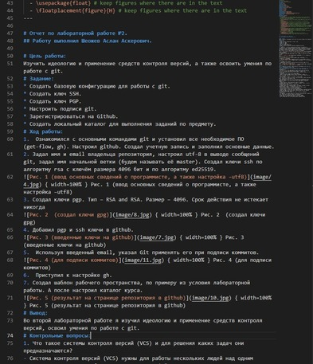

 # ***Презентация по лабораторной работе №3***
 ###### **Работу выполнил Шеожев Аслан Аскерович**
 <!-- _backgroundColor: #11ffee00 -->
 ---
 # Цель работы:
 * Научиться оформлять отчёты с помощью легковесного языка разметки Markdown.
<!-- _backgroundColor: #bfccbe -->
---
# Задание:
<!-- _backgroundColor: #bfccbe -->
* Сделать отчёт по предыдущей лабораторной работе в формате Markdown.
* В качестве отчёта предоставить отчёты в 3 форматах: pdf, docx и md.
---
<!-- _backgroundColor: #bfccbe -->
# Ход работы:
1. Изучил базовые сведения о Markdown.
2. Установил и настроил необходимое ПО.
3. Записал отчет в Markdown.
4. Перевел файл в pdf и docx.
---
# Скриншоты работы:
<!-- _backgroundColor: #98eddd -->
|    |         |  |
| ------------- |:------------------:| -----:|
| Рис. 1        | Рис. 2             |  Рис. 3 |