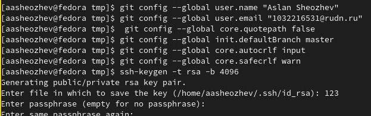
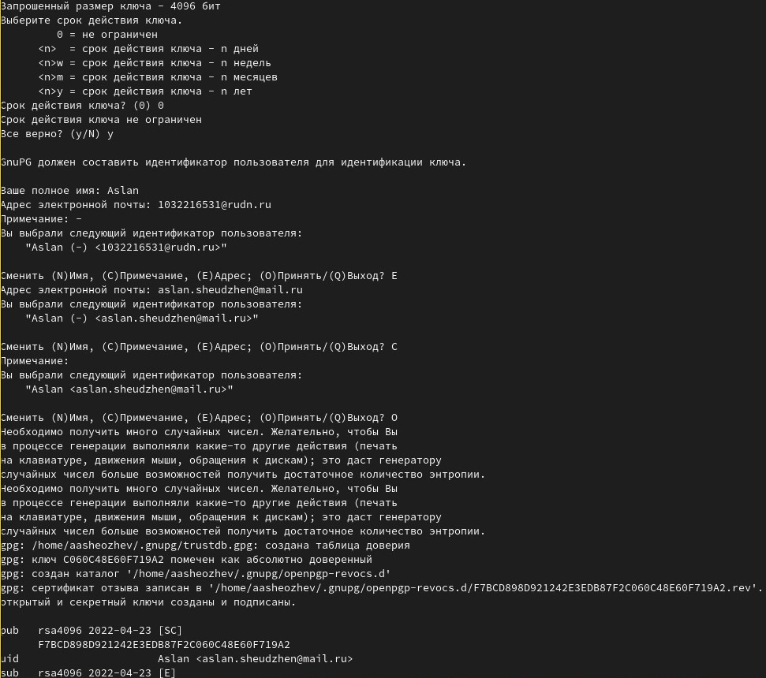
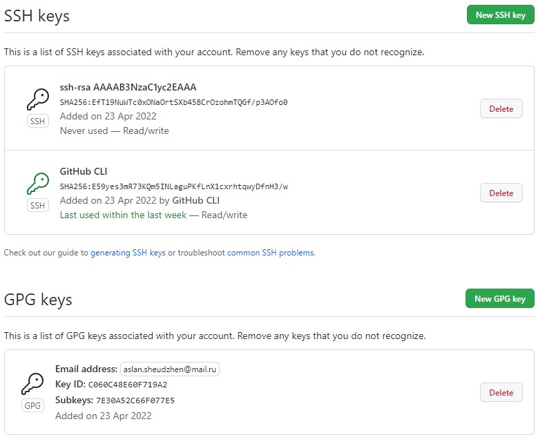
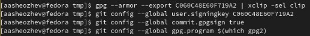
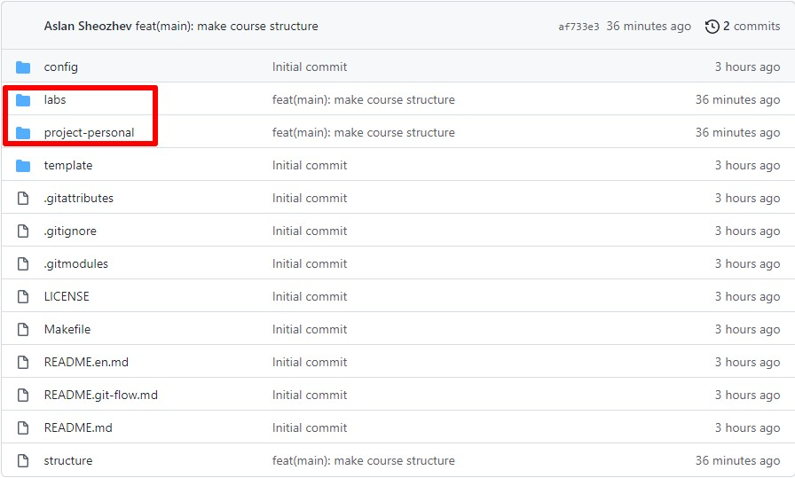

---
# Front matter
lang: ru-RU
title: "Лабораторная работа 2"
subtitle: "Управление версиями"
author: "Шеожев Аслан Аскерович"

# Formatting
toc-title: "Содержание"
toc: true # Table of contents
toc_depth: 2
fontsize: 12pt
linestretch: 1.5
papersize: a4paper
documentclass: scrreprt
polyglossia-lang: russian
polyglossia-otherlangs: english
mainfont: PT Serif
romanfont: PT Serif
sansfont: PT Sans
monofont: PT Mono
mainfontoptions: Ligatures=TeX
romanfontoptions: Ligatures=TeX
sansfontoptions: Ligatures=TeX,Scale=MatchLowercase
monofontoptions: Scale=MatchLowercase
indent: true
pdf-engine: lualatex
header-includes:
  - \linepenalty=10 # the penalty added to the badness of each line within a paragraph (no associated penalty node) Increasing the value makes tex try to have fewer lines in the paragraph.
  - \interlinepenalty=0 # value of the penalty (node) added after each line of a paragraph.
  - \hyphenpenalty=50 # the penalty for line breaking at an automatically inserted hyphen
  - \exhyphenpenalty=50 # the penalty for line breaking at an explicit hyphen
  - \binoppenalty=700 # the penalty for breaking a line at a binary operator
  - \relpenalty=500 # the penalty for breaking a line at a relation
  - \clubpenalty=150 # extra penalty for breaking after first line of a paragraph
  - \widowpenalty=150 # extra penalty for breaking before last line of a paragraph
  - \displaywidowpenalty=50 # extra penalty for breaking before last line before a display math
  - \brokenpenalty=100 # extra penalty for page breaking after a hyphenated line
  - \predisplaypenalty=10000 # penalty for breaking before a display
  - \postdisplaypenalty=0 # penalty for breaking after a display
  - \floatingpenalty = 20000 # penalty for splitting an insertion (can only be split footnote in standard LaTeX)
  - \raggedbottom # or \flushbottom
  - \usepackage{float} # keep figures where there are in the text
  - \floatplacement{figure}{H} # keep figures where there are in the text
---

# Отчет по лабораторной работе №2.
## Работу выполнил Шеожев Аслан Аскерович.

# Цель работы:
Изучить идеологию и применение средств контроля версий, а также освоить умения по работе с git.
# Задание:
* Создать базовую конфигурацию для работы с git.
* Создать ключ SSH.
* Создать ключ PGP.
* Настроить подписи git.
* Зарегистрироваться на Github.
* Создать локальный каталог для выполнения заданий по предмету.
# Ход работы:
1.	Ознакомился с основными командами git и установил все необходимое ПО (get-flow, gh). Настроил github. Создал учетную запись и заполнил основные данные.
2. Задал имя и email владельца репозитория, настроил utf-8 в выводе сообщений git, задал имя начальной ветки (будем называть её master). Создал ключи ssh по алгоритму rsa с ключём размера 4096 бит и по алгоритму ed25519.
 { width=100% } Рис. 1 (ввод основных сведений о программисте, а также настройка –utf8)
3. Создал ключи pgp. Тип – RSA and RSA. Размер – 4096. Срок действия не истекает никогда 
 { width=100% } Рис. 2  (создал ключи gpg)
4. Добавил pgp и ssh ключи в github. 
 { width=100% } Рис. 3 (введенные ключи на github)
5.	Используя введенный email, указал Git применять его при подписи коммитов.
 { width=100% } Рис. 4 (для подписи коммитов)
6.	Приступил к настройке gh.
7. Создал шаблон рабочего пространства, по примеру из условия лабораторной работы. А после настроил каталог курса.
 { width=100% } Рис. 5 (результат на странице репозитория в github)
# Вывод:
Во второй лабораторной работе я изучил идеологию и применение средств контроля версий, освоил умения по работе с git.
# Контрольные вопросы:
1. Что такое системы контроля версий (VCS) и для решения каких задач они предназначаются? 
- Система контроля версий (VCS) нужны для работы нескольких людей над одним проектом, совместная работа путем изменения файлов в репозитории.
2. Объясните следующие понятия VCS и их отношения: хранилище, commit, история, рабочая копия. 
- хранилище – это пространство для хранения файлов;
- commit – команда для записи индексированных изменений в репозитория;
- история – в ней расположены все коммиты, по которым можно отследить автора, дату и сообщение;
- рабочая копия – все файлы, кроме .git/ это рабочая копия.
3. Что представляют собой и чем отличаются централизованные и децентрализованные VCS? Приведите примеры VCS каждого вида.
- Централизованные системы контроля версий – проект и его файлы на 1 сервер, а децентрализованные системы контроля версия – при копировании данных данных удаленного репозитория, происходит полное копирование данных в локальный репозиторий.
4. Опишите действия с VCS при единоличной работе с хранилищем. 
- Создание репозиторий, добавление в них файлов, фиксация с помощью коммитов, изменение файлов репозитория.
5. Опишите порядок работы с общим хранилищем VCS. 
- Создание репозиториев, добавление файлов в него файлов, фиксация коммитами, изменение файлов репозитория, ожидание проверки коммитов.
6. Каковы основные задачи, решаемые инструментальным средством git?
- Систематизация и возможность разработки параллельно.
7. Назовите и дайте краткую характеристику командам git. 
- Создание репозитория (git init), клонирование (gin clone), добавление изменений в индекс (git add), коммиты (gir commit), удаление файла (git rm), удаление изменений из индекса (git reset).
8. Приведите примеры использования при работе с локальным и удалённым репозиториями. 
- Для написания черновика по лабораторным работам я могу использовать репозитории.
9. Что такое и зачем могут быть нужны ветви (branches)? 
- Ветки служат для реализации параллельного программирования.
10.	Как и зачем можно игнорировать некоторые файлы при commit?
- Игнорирование нужно для неотслеживания файлов  служебного типа. 
