---
# Front matter
lang: ru-RU
title: "Лабораторная работа 4"
subtitle: "Основы интерфейса взаимодействия пользователя с системой Unix на уровне командной строки"
author: "Шеожев Аслан Аскерович"

# Formatting
toc-title: "Содержание"
toc: true # Table of contents
toc_depth: 2
fontsize: 12pt
linestretch: 1.5
papersize: a4paper
documentclass: scrreprt
polyglossia-lang: russian
polyglossia-otherlangs: english
mainfont: PT Serif
romanfont: PT Serif
sansfont: PT Sans
monofont: PT Mono
mainfontoptions: Ligatures=TeX
romanfontoptions: Ligatures=TeX
sansfontoptions: Ligatures=TeX,Scale=MatchLowercase
monofontoptions: Scale=MatchLowercase
indent: true
pdf-engine: lualatex
header-includes:
  - \linepenalty=10 # the penalty added to the badness of each line within a paragraph (no associated penalty node) Increasing the value makes tex try to have fewer lines in the paragraph.
  - \interlinepenalty=0 # value of the penalty (node) added after each line of a paragraph.
  - \hyphenpenalty=50 # the penalty for line breaking at an automatically inserted hyphen
  - \exhyphenpenalty=50 # the penalty for line breaking at an explicit hyphen
  - \binoppenalty=700 # the penalty for breaking a line at a binary operator
  - \relpenalty=500 # the penalty for breaking a line at a relation
  - \clubpenalty=150 # extra penalty for breaking after first line of a paragraph
  - \widowpenalty=150 # extra penalty for breaking before last line of a paragraph
  - \displaywidowpenalty=50 # extra penalty for breaking before last line before a display math
  - \brokenpenalty=100 # extra penalty for page breaking after a hyphenated line
  - \predisplaypenalty=10000 # penalty for breaking before a display
  - \postdisplaypenalty=0 # penalty for breaking after a display
  - \floatingpenalty = 20000 # penalty for splitting an insertion (can only be split footnote in standard LaTeX)
  - \raggedbottom # or \flushbottom
  - \usepackage{float} # keep figures where there are in the text
  - \floatplacement{figure}{H} # keep figures where there are in the text
---

# Отчет по лабораторной работе №4.
## Работу выполнил Шеожев Аслан Аскерович.

# Цель работы:
Приобретение практических навыков взаимодействия пользователя с системой посредством командной строки.

# Ход работы:
1. Определил полное имя домашнего каталога. Далее относительно этого каталога выполнил последующие упражнения.

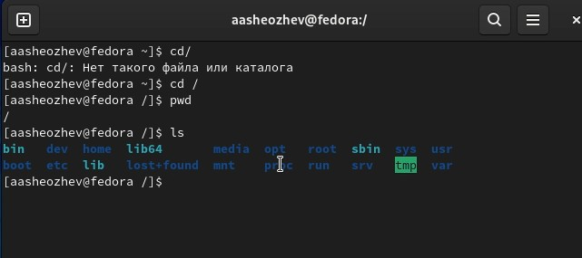 { width=100% } Рис. 1 (определил имя домашнего каталога)

2. Выполнил следующие действия:

* Перешел в каталог /tmp.

* Вывел на экран содержимое каталога /tmp. Для этого воспользовался командой ls с различными опциями.

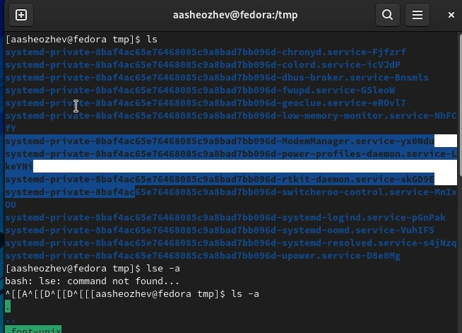 { width=100% } Рис. 2 (ls 1)

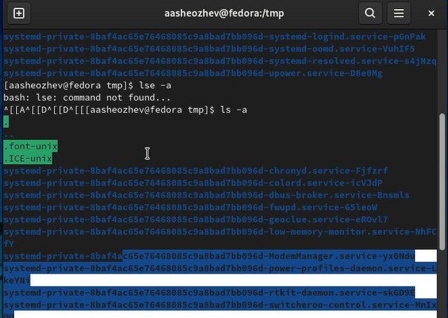 { width=100% } Рис. 3 (ls 2)

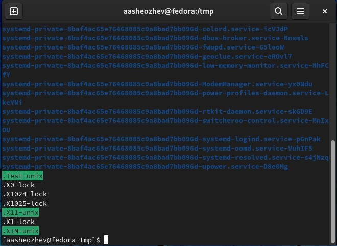 { width=100% } Рис. 4 (ls 3)

* Увидел, что в каталоге /var/spool отсутствует подкаталог с именем cron.

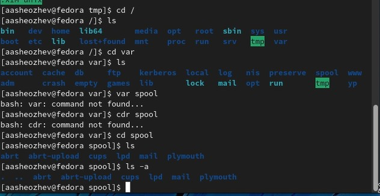 { width=100% } Рис. 5 (отсутствие подкаталога с именем cron)

* Перешел в домашний каталог и вывел на экран его содержимое.

3. Выполнил следующие действия:

* В домашнем каталоге создал новый каталог с именем newdir.

* В каталоге ~/newdir создал новый каталог с именем morefun.

* В домашнем каталоге создал одной командой три новых каталога с именами letters, memos, misk. Затем удалил эти каталоги одной командой.

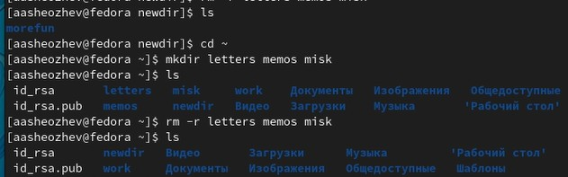 { width=100% } Рис. 6 (работа с файлами letters, memos, misk)

* Удалил ранее созданный каталог ~/newdir командой rm.

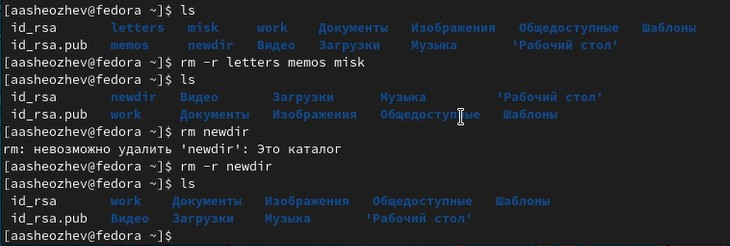 { width=100% } Рис. 7 (удаление newdir)

4. С помощью команды man определил, какую опцию команды ls нужно использовать для просмотра содержимое не только указанного каталога, но и подкаталогов, входящих в него.

5. С помощью команды man определил набор опций команды ls, позволяющий отсортировать по времени последнего изменения выводимый список содержимого каталога с развёрнутым описанием файлов.

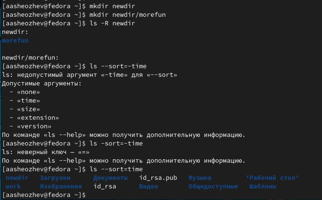 { width=100% } Рис. 8 (выполнение пункта 5)

6. Использовал команду man для просмотра описания следующих команд: cd, pwd, mkdir, rmdir, rm.

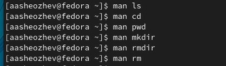 { width=100% } Рис. 9 (команда man)

7. Используя информацию, полученную при помощи команды history, выполнил модификацию и исполнение нескольких команд из буфера команд.

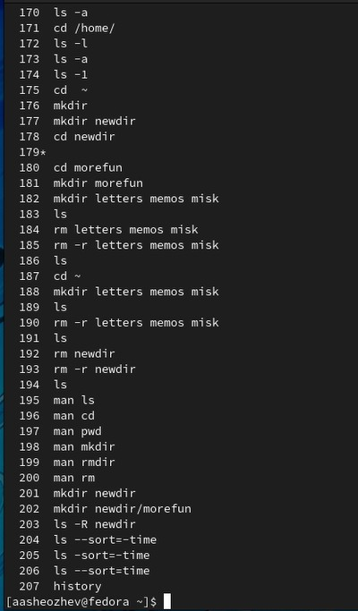 { width=100% } выполнение пункта 7 (1)

 { width=100% } выполнение пункта 7 (2)

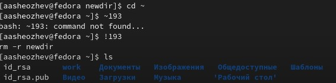 { width=100% } выполнение пункта 7 (3)

# Вывод:

Мною приобретены практические навыки взаимодействия пользователя с системой посредством командной строки.
# Контрольные вопросы:

1. Командная строка – это специальная программа, которая дает возможность управлять компьютером путем ввода команд с клавиатуры.
2. pwd dir
3. ls
4. ls -a
5. rm dir, rm -f -r dir
6. history
7. !CommandNumber from history
8. cd home; ls
9. Экранирование символов — замена в тексте управляющих символов на соответствующие текстовые подстановки. Один из видов управляющих последовательностей.