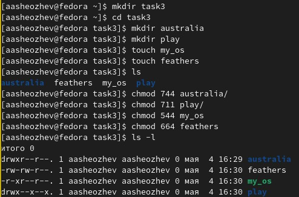
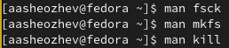

 # ***Презентация по лабораторной работе №5***
 ###### **Работу выполнил Шеожев Аслан Аскерович**
<!-- _backgroundColor: #fffacd -->
---
# Цель работы:
* Ознакомление с файловой системой Linux, её структурой, именами и содержанием каталогов. Приобретение практических навыков по применению команд для работы с файлами и каталогами, по управлению процессами (и работами), по проверке использования диска и обслуживанию файловой системы.
<!-- _backgroundColor: #ffdab9 -->
---
<!-- _backgroundColor: #ffdead -->
# Ход работы:
1. Последовательно выполнил следующие действия (Рис. 1):
1.1. Скопировал файл /usr/include/sys/io.h в домашний каталог и назовал его equipment. 
Команда: cp usr/include/sys/io.h ~/equipment
1.2. В домашнем каталоге создал директорию ~/ski.plases.
Команда: mkdir ski.plases
1.3. Переместил файл equipment в каталог ~/ski.plases.
Команда: mv equipment ski.plases/
1.4. Переименовал файл equipment в equiplist.
Команда: mv ski.plases/equipment ski.plases/equiplist
1.5. Создал в домашнем каталоге файл abc1 и скопировал его в каталог ~/ski.plases, назвал его equiplist2.
---
Команды:
* touch abc1
* cp abc1 ski.plases/equiplist2
1.6. Создал каталог с именем equipment в каталоге ~/ski.plases.
Команда: mkdir ski.plases/equipment
1.7. Переместил файлы equiplist и equiplist2 в каталог ~/ski.plases/equipment.
Команды:
* mv ski.plases/equiplist ski.plases/equipment/
* mv ski.plases/equiplist2 ski.plases/equipment/
1.8. Создал и переместил каталог newdir в каталог ~/ski.plases и назвал его plans.
Команды:
* mkdir newdir
<!-- _backgroundColor: #ffdead -->
* mv newdir ski.plases/plans
---
<!-- _backgroundColor: #f8f8ff -->
2. Определил опции команды chmod, необходимые для того, чтобы присвоить перечисленным ниже файлам выделенные права доступа, считая, что в начале таких прав нет (Рис. 1):

Рис. 1 (выполнение пункта 2)

---
3. Проделал приведённые ниже упражнения:
3.1. Просмотрел содержимое файла /etc/password.
Команда: cat passwd
3.2. Скопировал файл feathers в файл ~/file.old.
Команда: cp feathers file.old
3.3. Переместил файл file.old в каталог ~/play.
Команда: cp file.old task3/play
3.4. Скопировал каталог play в каталог ~/fun.
Команда: cp -r play/ fun/
3.5. Переместил каталог fun в каталог ~/play и назовите его games.
Команда: mv  fun/ play/games/
3.6. Лишил владельца файла ~/feathers права на чтение.
Команда: chmod o-r feathers
3.7. При попытке просмотреть файл ~/feathers командой cat ничего не происходит.
Команда: cat feathers
<!-- _backgroundColor: #fffba0 -->

---

3.8. При попытке скопировать файл ~/feathers он копируется.
Команда: cp feathers temp_file
3.9. Дал владельцу файла ~/feathers право на чтение.
Команда: chmod o+r feathers
3.10. Лишил владельца каталога ~/play права на выполнение.
Команда: chmod o-x play/
3.11. Перешел в каталог ~/play.
Команда: cd play/
3.12. Дал владельцу каталога ~/play право на выполнение.
Команда: chmod o+x play/
4. Прочитал man по командам fsck, mkfs, kill.

Рис. 2 (man)
<!-- _backgroundColor: #87ceeb -->

---
# Вывод:
<!-- _backgroundColor: #c0c0c0 -->
* Я ознакомился с файловой системой Linux, её структурой, именами и содержанием каталогов. Приобрёл практических навыки по применению команд для работы с файлами и каталогами, по управлению процессами (и работами), по проверке использования диска и обслуживанию файловой системы.