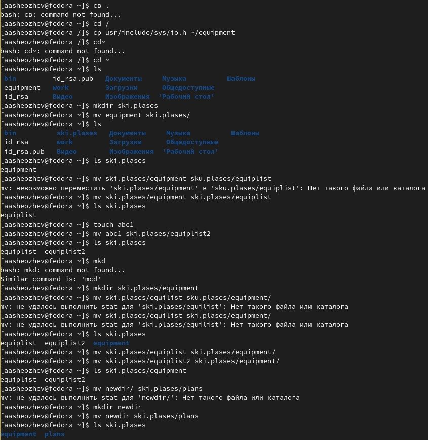
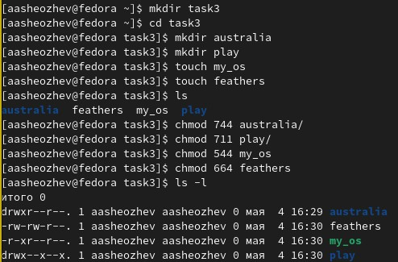
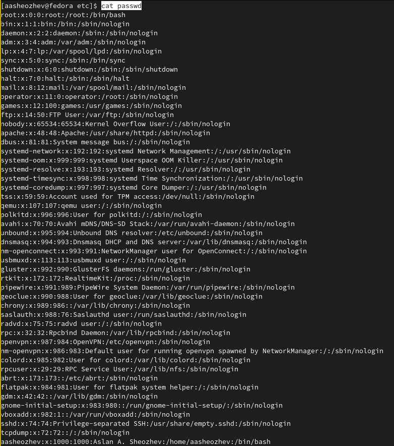
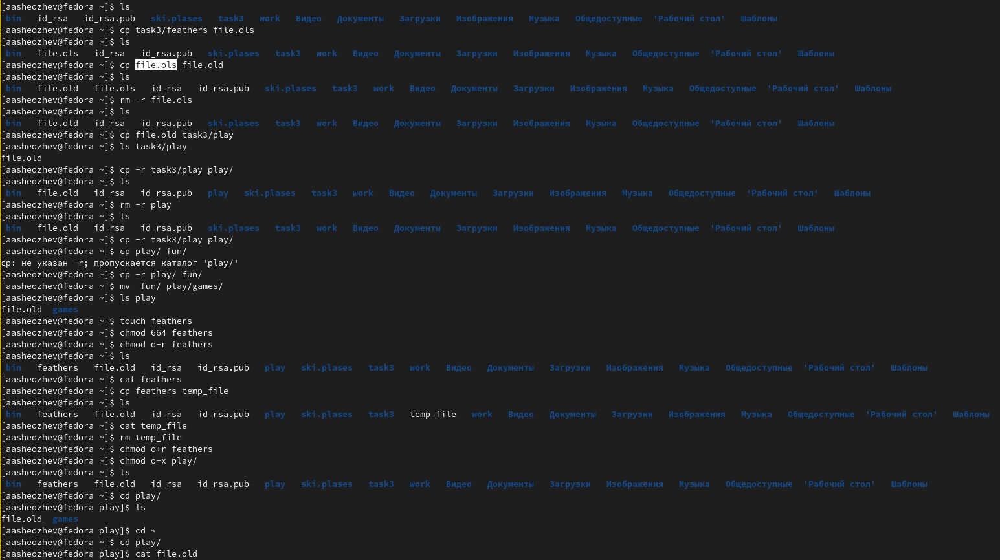
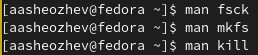

---
# Front matter
lang: ru-RU
title: "Лабораторная работа 5"
subtitle: "Основы интерфейса взаимодействия пользователя с системой Unix на уровне командной строки"
author: "Шеожев Аслан Аскерович"

# Formatting
toc-title: "Содержание"
toc: true # Table of contents
toc_depth: 2
fontsize: 12pt
linestretch: 1.5
papersize: a4paper
documentclass: scrreprt
polyglossia-lang: russian
polyglossia-otherlangs: english
mainfont: PT Serif
romanfont: PT Serif
sansfont: PT Sans
monofont: PT Mono
mainfontoptions: Ligatures=TeX
romanfontoptions: Ligatures=TeX
sansfontoptions: Ligatures=TeX,Scale=MatchLowercase
monofontoptions: Scale=MatchLowercase
indent: true
pdf-engine: lualatex
header-includes:
  - \linepenalty=10 # the penalty added to the badness of each line within a paragraph (no associated penalty node) Increasing the value makes tex try to have fewer lines in the paragraph.
  - \interlinepenalty=0 # value of the penalty (node) added after each line of a paragraph.
  - \hyphenpenalty=50 # the penalty for line breaking at an automatically inserted hyphen
  - \exhyphenpenalty=50 # the penalty for line breaking at an explicit hyphen
  - \binoppenalty=700 # the penalty for breaking a line at a binary operator
  - \relpenalty=500 # the penalty for breaking a line at a relation
  - \clubpenalty=150 # extra penalty for breaking after first line of a paragraph
  - \widowpenalty=150 # extra penalty for breaking before last line of a paragraph
  - \displaywidowpenalty=50 # extra penalty for breaking before last line before a display math
  - \brokenpenalty=100 # extra penalty for page breaking after a hyphenated line
  - \predisplaypenalty=10000 # penalty for breaking before a display
  - \postdisplaypenalty=0 # penalty for breaking after a display
  - \floatingpenalty = 20000 # penalty for splitting an insertion (can only be split footnote in standard LaTeX)
  - \raggedbottom # or \flushbottom
  - \usepackage{float} # keep figures where there are in the text
  - \floatplacement{figure}{H} # keep figures where there are in the text
---

# Отчет по лабораторной работе №5.
### Работу выполнил Шеожев Аслан Аскерович. 

## Цель работы:

Ознакомление с файловой системой Linux, её структурой, именами и содержанием
каталогов. Приобретение практических навыков по применению команд для работы
с файлами и каталогами, по управлению процессами (и работами), по проверке использования диска и обслуживанию файловой системы.

## Ход работы:
1. Последовательно выполнил следующие действия (Рис. 1):

1.1. Скопировал файл /usr/include/sys/io.h в домашний каталог и назовал его equipment. 

Команда: cp usr/include/sys/io.h ~/equipment

1.2. В домашнем каталоге создал директорию ~/ski.plases.

Команда: mkdir ski.plases

1.3. Переместил файл equipment в каталог ~/ski.plases.

Команда: mv equipment ski.plases/

1.4. Переименовал файл equipment в equiplist.

Команда: mv ski.plases/equipment ski.plases/equiplist

1.5. Создал в домашнем каталоге файл abc1 и скопировал его в каталог ~/ski.plases, назвал его equiplist2.

Команды:

* touch abc1

* cp abc1 ski.plases/equiplist2

1.6. Создал каталог с именем equipment в каталоге ~/ski.plases.

Команда: mkdir ski.plases/equipment

1.7. Переместил файлы equiplist и equiplist2 в каталог ~/ski.plases/equipment.

Команды:

* mv ski.plases/equiplist ski.plases/equipment/

* mv ski.plases/equiplist2 ski.plases/equipment/

1.8. Создал и переместил каталог newdir в каталог ~/ski.plases и назвал его plans.

Команды:

* mkdir newdir

* mv newdir ski.plases/plans

 { width=100% } Рис. 1 (выполнение пункта 1)

2. Определил опции команды chmod, необходимые для того, чтобы присвоить перечисленным ниже файлам выделенные права доступа, считая, что в начале таких прав нет (Рис. 2):

 { width=100% } Рис. 2 (выполнение пункта 2)

3. Проделал приведённые ниже упражнения:

3.1. Просмотрел содержимое файла /etc/password (Рис. 3).

Команда: cat passwd

 { width=100% } Рис. 3 (просмотр содержимого файла passwd)

3.2. Скопировал файл feathers в файл ~/file.old (Рис. 4).

Команда: cp feathers file.old

3.3. Переместил файл file.old в каталог ~/play (Рис. 4).

Команда: cp file.old task3/play

3.4. Скопировал каталог play в каталог ~/fun (Рис. 4).

Команда: cp -r play/ fun/

3.5. Переместил каталог fun в каталог ~/play и назовите его games (Рис. 4).

Команда: mv  fun/ play/games/

3.6. Лишил владельца файла ~/feathers права на чтение (Рис. 4).

Команда: chmod o-r feathers

3.7. При попытке просмотреть файл ~/feathers командой cat (Рис. 4) ничего не происходит.

Команда: cat feathers

3.8. При попытке скопировать файл ~/feathers (Рис. 4) он копируется.

Команда: cp feathers temp_file

3.9. Дал владельцу файла ~/feathers право на чтение (Рис. 4).

Команда: chmod o+r feathers

3.10. Лишил владельца каталога ~/play права на выполнение (Рис. 4).

Команда: chmod o-x play/

3.11. Перешел в каталог ~/play (Рис. 4).

Команда: cd play/

3.12. Дал владельцу каталога ~/play право на выполнение (Рис. 4).

Команда: chmod o+x play/

 { width=100% } Рис. 4 (выполнение пунктов 3.2 - 3.12)

4. Прочитал man по командам fsck, mkfs, kill (Рис. 5).

 { width=100% } Рис. 5 (man)

## Вывод:

Я ознакомился с файловой системой Linux, её структурой, именами и содержанием
каталогов. Приобрёл практических навыки по применению команд для работы
с файлами и каталогами, по управлению процессами (и работами), по проверке использования диска и обслуживанию файловой системы.

## Контрольные вопросы:
Вопрос №1

NTFS (аббревиатура от англ. new technology file system — «файловая система новой технологии») — стандартная файловая система для семейства операционных систем Windows NT фирмы Microsoft. NTFS поддерживает хранение метаданных. С целью улучшения производительности, надёжности и эффективности использования дискового пространства для хранения информации о файлах в NTFS используются специализированные структуры данных. Информация о файлах хранится в главной файловой таблице — Master File Table (MFT). NTFS поддерживает разграничение доступа к данным для различных пользователей и групп пользователей (списки контроля доступа — англ. access control lists, ACL), а также позволяет назначать дисковые квоты (ограничения на максимальный объём дискового пространства, занимаемый файлами тех или иных пользователей). Для повышения надёжности файловой системы в NTFS используется система журналирования USN. Для NTFS размер кластера по умолчанию составляет от 512 байт до 2 МБ в зависимости от размера тома и версии ОС.

Вопрос №2

/ — root каталог. Содержит в себе всю иерархию системы;

/bin — здесь находятся двоичные исполняемые файлы. Основные общие команды, хранящиеся отдельно от других программ в системе (прим.: pwd, ls, cat, ps);

/boot — тут расположены файлы, используемые для загрузки системы (образ initrd, ядро vmlinuz);

/dev — в данной директории располагаются файлы устройств (драйверов). С помощью этих файлов можно взаимодействовать с устройствами. К примеру, если это жесткий диск, можно подключить его к файловой системе. В файл принтера же можно написать напрямую и отправить задание на печать;

/etc — в этой директории находятся файлы конфигураций программ. Эти файлы позволяют настраивать системы, сервисы, скрипты системных демонов;

/home — каталог, аналогичный каталогу Users в Windows. Содержит домашние каталоги учетных записей пользователей (кроме root). При создании нового пользователя здесь создается одноименный каталог с аналогичным именем и хранит личные файлы этого пользователя;

/lib — содержит системные библиотеки, с которыми работают программы и модули ядра;

/lost+found — содержит файлы, восстановленные после сбоя работы системы. Система проведет проверку после сбоя и найденные файлы можно будет посмотреть в данном каталоге;

/media — точка монтирования внешних носителей. Например, когда вы вставляете диск в дисковод, он будет автоматически смонтирован в директорию /media/cdrom;

/mnt — точка временного монтирования. Файловые системы подключаемых устройств обычно монтируются в этот каталог для временного использования;

/opt — тут расположены дополнительные (необязательные) приложения. Такие программы обычно не подчиняются принятой иерархии и хранят свои файлы в одном подкаталоге (бинарные, библиотеки, конфигурации);

/proc — содержит файлы, хранящие информацию о запущенных процессах и о состоянии ядра ОС;

/root — директория, которая содержит файлы и личные настройки суперпользователя;

/run — содержит файлы состояния приложений. Например, PID-файлы или UNIX-сокеты;

/sbin — аналогично /bin содержит бинарные файлы. Утилиты нужны для настройки и администрирования системы суперпользователем;

/srv — содержит файлы сервисов, предоставляемых сервером (прим. FTP или Apache HTTP);

/sys — содержит данные непосредственно о системе. Тут можно узнать информацию о ядре, драйверах и устройствах;

/tmp — содержит временные файлы. Данные файлы доступны всем пользователям на чтение и запись. Стоит отметить, что данный каталог очищается при перезагрузке;

/usr — содержит пользовательские приложения и утилиты второго уровня, используемые пользователями, а не системой. Содержимое доступно только для чтения (кроме root). Каталог имеет вторичную иерархию и похож на корневой;

/var — содержит переменные файлы. Имеет подкаталоги, отвечающие за отдельные переменные. Например, логи будут храниться в /var/log, кэш в /var/cache, очереди заданий в /var/spool/ и так далее.

Вопрос №3

Монтирование тома

Вопрос №4

Отсутствие синхронизации между образом файловой системы в памяти и ее данными на диске в случае аварийного останова может привести к появлению следующих ошибок:

Один блок адресуется несколькими mode (принадлежит нескольким файлам).

Блок помечен как свободный, но в то же время занят (на него ссылается onode).

Блок помечен как занятый, но в то же время свободен (ни один inode на него не ссылается).

Неправильное число ссылок в inode (недостаток или избыток ссылающихся записей в каталогах).

Несовпадение между размером файла и суммарным размером адресуемых inode блоков.

Недопустимые адресуемые блоки (например, расположенные за пределами файловой системы).

"Потерянные" файлы (правильные inode, на которые не ссылаются записи каталогов).

Недопустимые или неразмещенные номера inode в записях каталогов.

Вопрос №5

mkfs - позволяет создать файловую систему Linux.

Вопрос №6

Cat - выводит содержимое файла

less - постраничный просмотр файлов

Вопрос №7

cp - копирование файлов

Вопрос №8

mv - перемещение файлов/директорий в другие директории, а также переименование файлов/директорий

Вопрос №9

Права доступа к файлу или каталогу можно изменить с помощью команды chmod. Сделать это может владелец файла (или каталога) или пользователь с правами администратора.