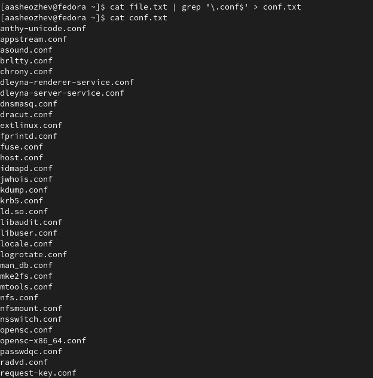
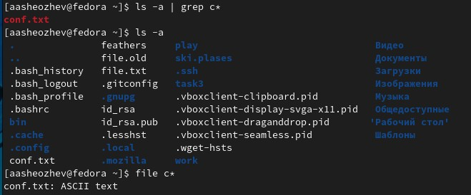
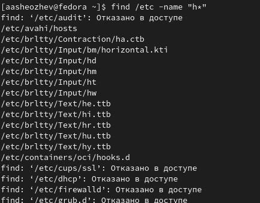
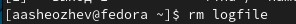
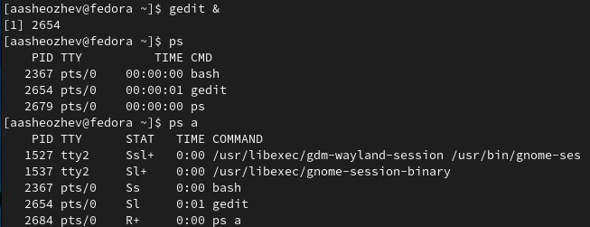
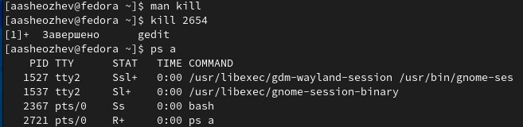
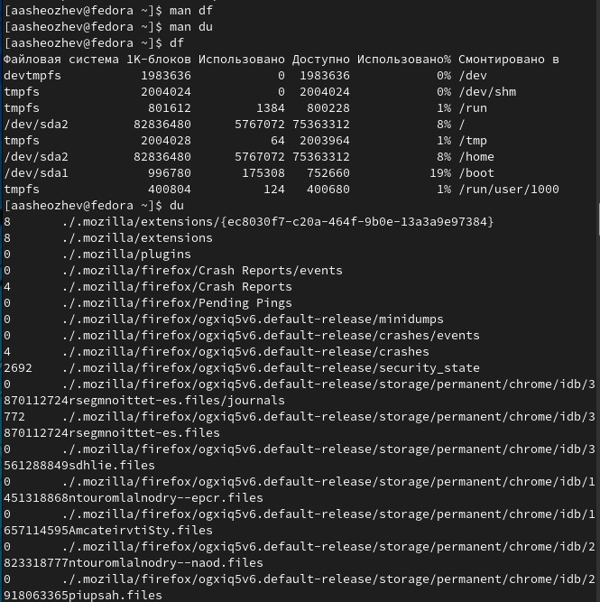
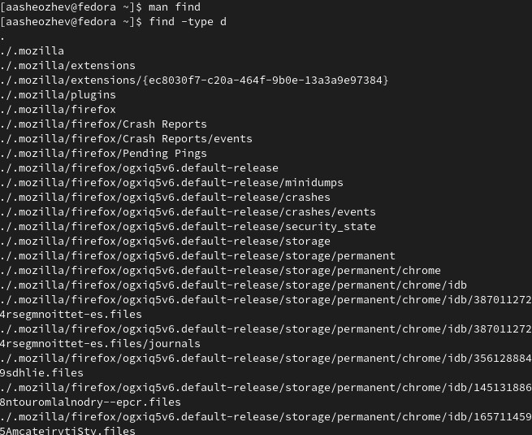

# ***Презентация по лабораторной работе №6***
###### **Работу выполнил Шеожев Аслан Аскерович**
<!-- _backgroundColor: #11ffee00 -->
---
# Цель работы:
 Ознакомление с инструментами поиска файлов и фильтрации текстовых данных. Приобретение практических навыков: по управлению процессами (и заданиями), по проверке использования диска и обслуживанию файловых систем.
<!-- _backgroundColor: #bfccbe -->
---
<!-- _backgroundColor: #bfccbe -->
# Ход работы:
1. Осуществил вход в систему.

2. Записал в файл file.txt названия файлов, содержащихся в каталоге /etc. Дописал в этот же файл названия файлов, содержащихся в вашем домашнем каталоге.
3. Вывел имена всех файлов из file.txt, имеющих расширение .conf, после чего записал их в новый текстовой файл conf.txt (Рис. 1). 

---

Рис. 1 (отбор файлов с расширением .conf и запись их в conf.txt)
<!-- _backgroundColor: #bfccbe -->
---

4. Определил, какие файлы в вашем домашнем каталоге имеют имена, начинавшиеся с символа c (Рис. 2).
<!-- _backgroundColor: #bfccbe -->
 
Рис. 2 (отбор файлов начинающихся с символа c)

---

5. Вывел на экран (по странично) имена файлов из каталога /etc, начинавшихся с символа h (Рис. 3).

 
Рис. 3 (вывел файлы из /etc, начинающиеся с символа h)
<!-- _backgroundColor: #bfccbe -->
---

6. Запустил в фоновом режиме процесс, который будет записывать в файл ~/logfile файлы, имена которых начинаются с log (Рис. 4).

 
Рис. 4 (команда для пункта 6)
<!-- _backgroundColor: #bfccbe -->
7. Удалил файл ~/logfile (Рис. 5).
<!-- _backgroundColor: #bfccbe -->

Рис. 5 (удаление logfile)

---
<!-- _backgroundColor: #bfccbe -->
8. Запустил из консоли в фоновом режиме редактор gedit (Рис. 6).
9. Определил идентификатор процесса gedit (Рис. 6).

Рис. 6 (выполнение пункта 8 и 9)

---
<!-- _backgroundColor: #bfccbe -->
10. Прочитал справку (man) команды kill, после чего использовал её для завершения процесса gedit (Рис. 7).

Рис. 7 (выполнение пункта 10)

11. Выполнил команды df и du, предварительно получив более подробную информацию об этих командах, с помощью команды man (Рис. 8).

---
<!-- _backgroundColor: #bfccbe -->
 Рис. 8 (du и df)

---

12. Воспользовавшись справкой команды find, выведил имена всех директорий, имеющихся в домашнем каталоге (Рис. 9).
 
Рис. 9 (выполнение пункта 12)
<!-- _backgroundColor: #bfccbe -->
---

# Вывод:

Я ознакомился с инструментами поиска файлов и фильтрации текстовых данных, приобрел практические навыки: по управлению процессами (и заданиями), по проверке использования диска и обслуживанию файловых систем.
<!-- _backgroundColor: #bfccbe -->