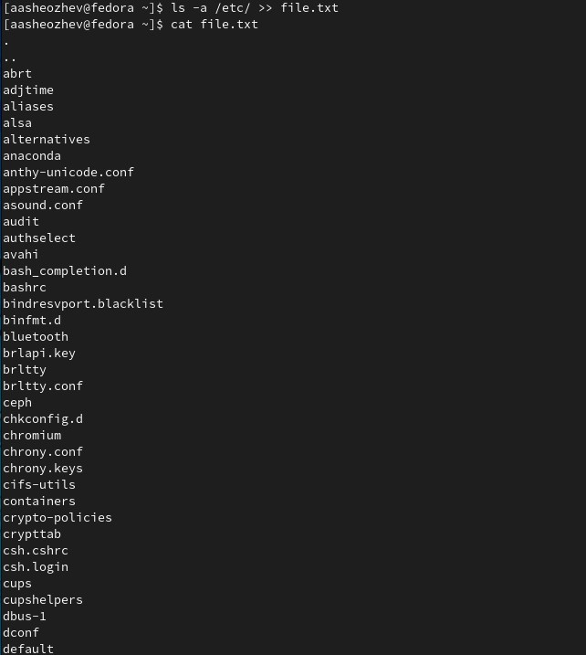
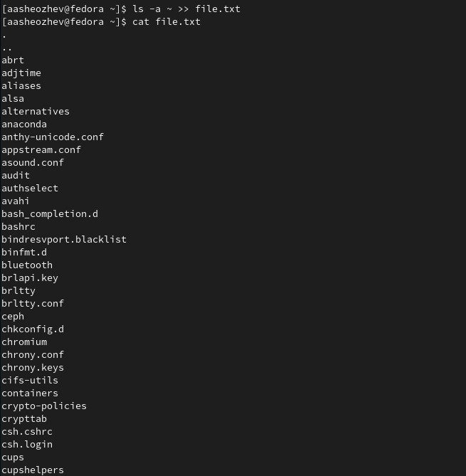
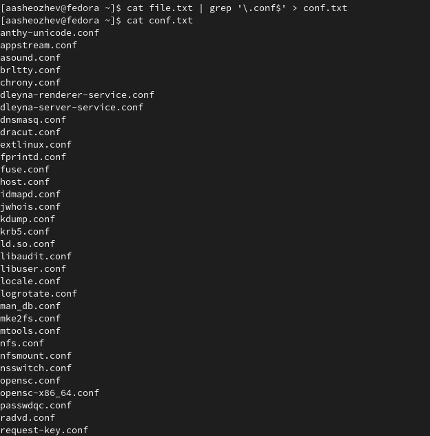
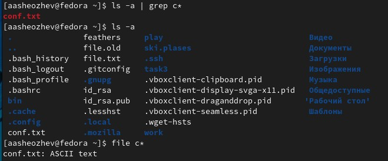
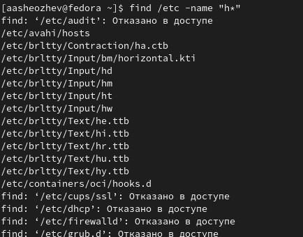
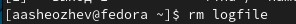
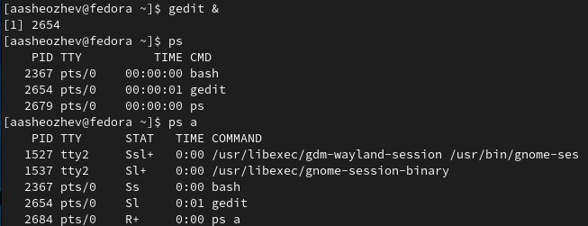
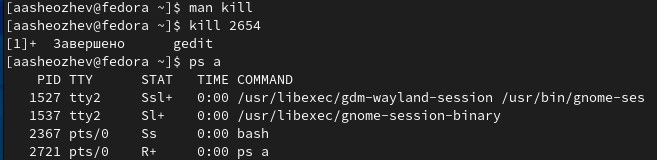
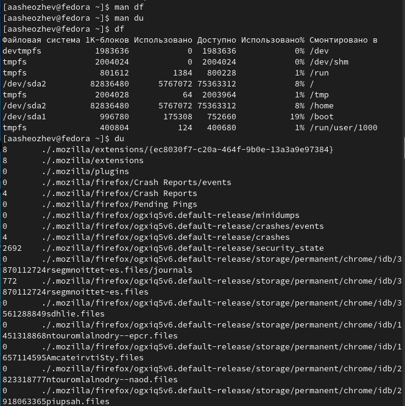

---
# Front matter
lang: ru-RU
title: "Лабораторная работа 6"
subtitle: "Поиск файлов. Перенаправление ввода-вывода. Просмотр запущенных процессов."
author: "Шеожев Аслан Аскерович"

# Formatting
toc-title: "Содержание"
toc: true # Table of contents
toc_depth: 2
fontsize: 12pt
linestretch: 1.5
papersize: a4paper
documentclass: scrreprt
polyglossia-lang: russian
polyglossia-otherlangs: english
mainfont: PT Serif
romanfont: PT Serif
sansfont: PT Sans
monofont: PT Mono
mainfontoptions: Ligatures=TeX
romanfontoptions: Ligatures=TeX
sansfontoptions: Ligatures=TeX,Scale=MatchLowercase
monofontoptions: Scale=MatchLowercase
indent: true
pdf-engine: lualatex
header-includes:
  - \linepenalty=10 # the penalty added to the badness of each line within a paragraph (no associated penalty node) Increasing the value makes tex try to have fewer lines in the paragraph.
  - \interlinepenalty=0 # value of the penalty (node) added after each line of a paragraph.
  - \hyphenpenalty=50 # the penalty for line breaking at an automatically inserted hyphen
  - \exhyphenpenalty=50 # the penalty for line breaking at an explicit hyphen
  - \binoppenalty=700 # the penalty for breaking a line at a binary operator
  - \relpenalty=500 # the penalty for breaking a line at a relation
  - \clubpenalty=150 # extra penalty for breaking after first line of a paragraph
  - \widowpenalty=150 # extra penalty for breaking before last line of a paragraph
  - \displaywidowpenalty=50 # extra penalty for breaking before last line before a display math
  - \brokenpenalty=100 # extra penalty for page breaking after a hyphenated line
  - \predisplaypenalty=10000 # penalty for breaking before a display
  - \postdisplaypenalty=0 # penalty for breaking after a display
  - \floatingpenalty = 20000 # penalty for splitting an insertion (can only be split footnote in standard LaTeX)
  - \raggedbottom # or \flushbottom
  - \usepackage{float} # keep figures where there are in the text
  - \floatplacement{figure}{H} # keep figures where there are in the text
---

# Отчет по лабораторной работе №6.
### Работу выполнил Шеожев Аслан Аскерович. 

## Цель работы:

Ознакомление с инструментами поиска файлов и фильтрации текстовых данных. Приобретение практических навыков: по управлению процессами (и заданиями), по проверке использования диска и обслуживанию файловых систем.

## Ход работы:

1. Осуществил вход в систему.

2. Записал в файл file.txt названия файлов, содержащихся в каталоге /etc. Дописал в этот же файл названия файлов, содержащихся в вашем домашнем каталоге (Рис. 1 - Рис. 2).

     { width=100% } Рис. 1 (работа с file.txt 1)

     { width=100% } Рис. 1 (работа с file.txt 2)

3. Вывел имена всех файлов из file.txt, имеющих расширение .conf, после чего записал их в новый текстовой файл conf.txt (Рис. 3). 

     { width=100% } Рис. 3 (отбор файлов с расширением .conf и запись их в conf.txt)

4. Определил, какие файлы в вашем домашнем каталоге имеют имена, начинавшиеся с символа c (Рис. 4).

     { width=100% } Рис. 4 (отбор файлов начинающихся с символа c)

5. Вывел на экран (по странично) имена файлов из каталога /etc, начинавшихся с символа h (Рис. 5).

     { width=100% } Рис. 5 (вывел файлы из /etc, начинающиеся с символа h)

6. Запустил в фоновом режиме процесс, который будет записывать в файл ~/logfile файлы, имена которых начинаются с log (Рис. 6).

     { width=100% } Рис. 6 (команда для пункта 6)

7. Удалил файл ~/logfile (Рис. 7).

     { width=100% } Рис. 7 (удаление logfile)

8. Запустил из консоли в фоновом режиме редактор gedit (Рис. 8).
9. Определил идентификатор процесса gedit (Рис. 8).

     { width=100% } Рис. 8 (выполнение пункта 8 и 9)

10. Прочитал справку (man) команды kill, после чего использовал её для завершения процесса gedit (Рис. 9).

     { width=100% } Рис. 9 (выполнение пункта 10)

11. Выполнил команды df и du, предварительно получив более подробную информацию об этих командах, с помощью команды man (Рис. 10).

     { width=100% } Рис. 10 (du и df)

12. Воспользовавшись справкой команды find, выведил имена всех директорий, имеющихся в домашнем каталоге (Рис. 11).

     { width=100% } Рис. 11 (выполнение пункта 12)

## Вывод:

Я ознакомился с инструментами поиска файлов и фильтрации текстовых данных, приобрел практические навыки: по управлению процессами (и заданиями), по проверке использования диска и обслуживанию файловых систем.

## Контрольные вопросы:
Вопрос 1:

– stdin — стандартный поток ввода (по умолчанию: клавиатура), файловый дескриптор 0;

– stdout — стандартный поток вывода (по умолчанию: консоль), файловый дескриптор 1;

– stderr — стандартный поток вывод сообщений об ошибках (по умолчанию: консоль), файловый дескриптор 2.

Вопрос 2:

">" - открывает файл на перезапись
">>" - открывает файл на дозапись

Вопрос 3:

Направление вывода на вход для следующей команды

Вопрос 4:

Процесс - это исполняемая программа. Программа - это набор инструкций, которые выполняют определенную задачу при выполнении компьютером, в то время как процесс является экземпляром выполняемой компьютерной программы. Таким образом, в этом главное отличие программы и процесса.

Вопрос 5:

pid: это идентификатор процесса (PID) процесса.
GID: идентификатор группы. Все группы Linux определяются GID (идентификаторами групп). GID хранятся в файле /etc/groups.