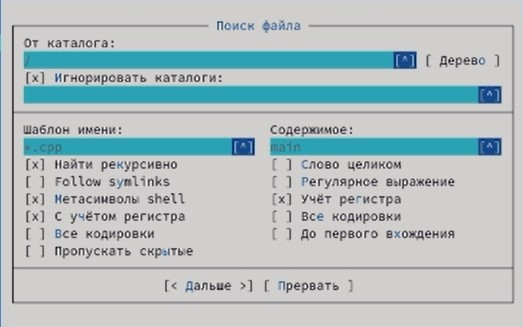
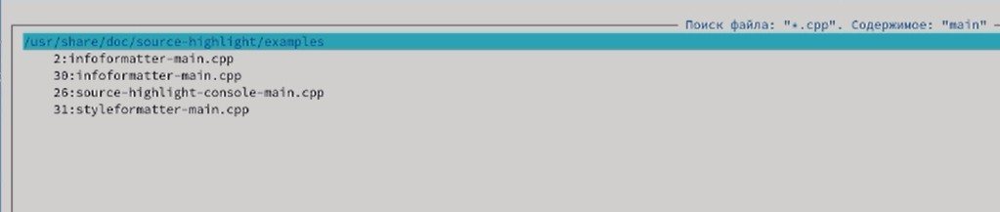
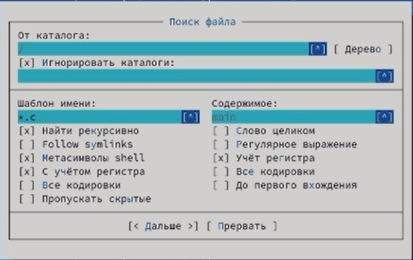
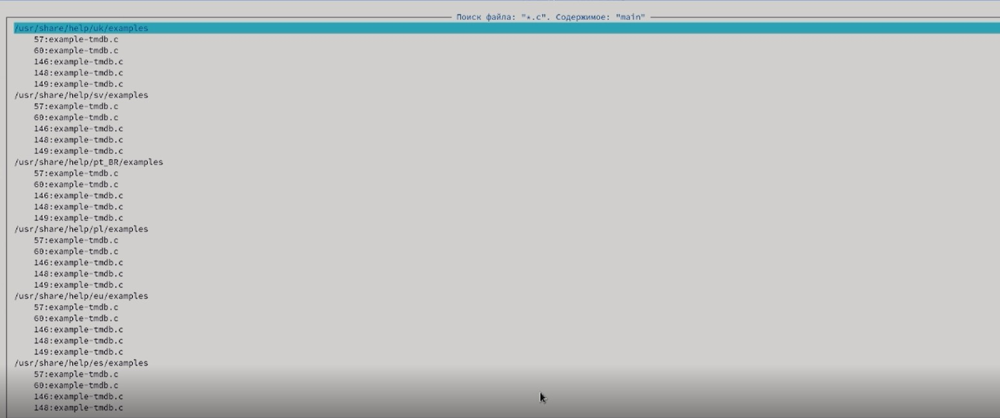
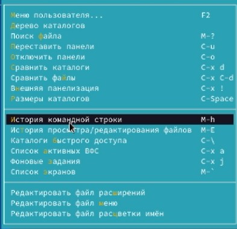
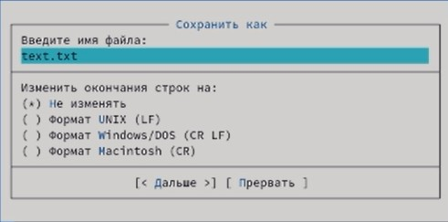
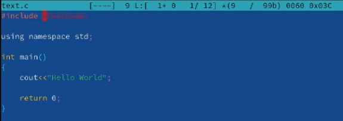
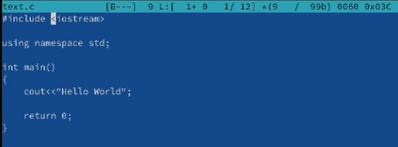

 # ***Презентация по лабораторной работе №7***
 ###### **Работу выполнил Шеожев Аслан Аскерович**
<!-- _backgroundColor: #fffacd -->
---
# Цель работы:
* Освоение основных возможностей командной оболочки Midnight Commander. Приобретение навыков практической работы по просмотру каталогов и файлов; манипуляций с ними.
<!-- _backgroundColor: #ffdab9 -->
---
<!-- _backgroundColor: #ffdead -->
# Ход работы:
1. Изучил информацию о mc, вызвав в командной строке man mc.

2. Запустил из командной строки mc, изучил его структуру и меню.

3. Выполнил несколько операций в mc, используя управляющие клавиши (операции с панелями выделение/отмена выделения файлов, копирование/перемещение файлов, получение информации о размере и правах доступа на файлы и/или каталоги и т.п.)

4. Выполнил основные команды меню левой (или правой) панели. Оценил степень подробности вывода информации о файлах.

---

5. Используя возможности подменю Файл, выполнил:
* просмотр содержимого текстового файла;
* редактирование содержимого текстового файла (без сохранения результатов редактирования);
* создание каталога;
* копирование в файлов в созданный каталог.
<!-- _backgroundColor: #fffba0 -->
6. С помощью соответствующих средств подменю Команда осуществил:
* поиск в файловой системе файла с заданными условиями (Рис. 1-4);
* выбор и повторение одной из предыдущих команд (Рис. 5);
* переход в домашний каталог;
* анализ файла меню и файла расширений.

---

Рис. 1 (поиск файла .cpp, содержащего main)

Рис. 2 (результат поиска 1)
<!-- _backgroundColor: #873eeb -->
---

Рис. 3 (поиск файла .c, содержащего main)
<!-- _backgroundColor: #c0c0c0 -->
---

Рис. 4 (результат поиска 2)
<!-- _backgroundColor: #f99ba0 -->

---

Рис. 5 (историй командной строки)
<!-- _backgroundColor: #f8f8ff -->

7. Вызвал подменю Настройки. Освоил операции, определяющие структуру экрана mc (Full screen, Double Width, Show Hidden Files и т.д.).

---

8. Создал текстовой файл text.txt (Рис. 6).

Рис. 6 (создание нового файла)

9. Открыл этот файл с помощью встроенного в mc редактора.

10. Вставил в открытый файл небольшой фрагмент текста, скопированный из любого другого файла или Интернета.
<!-- _backgroundColor: #fffba0 -->
---

11. Проделал с текстом следующие манипуляции, используя горячие клавиши:

    11.1. Удалил строку текста.

    11.2. Выделил фрагмент текста и скопировал его на новую строку
    
    11.3. Выделил фрагмент текста и перенес его на новую строку.

    11.4. Сохранил файл.

    11.5. Отменил последнее действие.

    11.6. Перешел в конец файла (нажав комбинацию клавиш) и написал некоторый текст.
    
    11.7. Перешел в начало файла (нажав комбинацию клавиш) и написал некоторый текст.
    
    11.8. Сохранил и закройте файл.
<!-- _backgroundColor: #f8f8ff -->
---

12. Открыл файл с исходным текстом на некотором языке программирования (например C или Java)
13. Используя меню редактора, включил подсветку синтаксиса (Рис. 7-8).

Рис. 7 (включение подсветки)

Рис. 8 (выключение подсветки)
<!-- _backgroundColor: #ffdead -->

---
# Вывод:
<!-- _backgroundColor: #c0c0c0 -->
* Я освоил основные возможности командной оболочки Midnight Commander. Приобрел навыки практической работы по просмотру каталогов и файлов; манипуляций с ними.