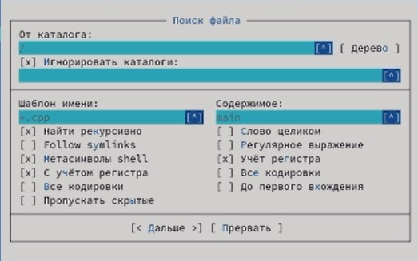
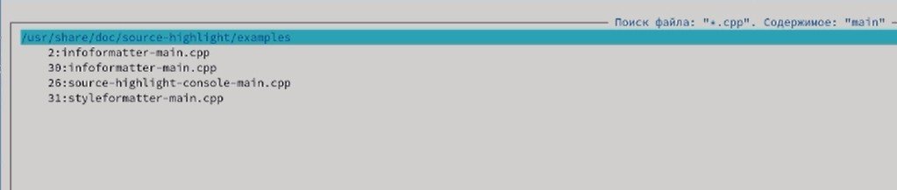
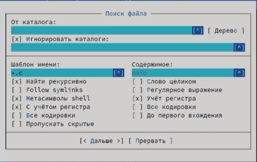
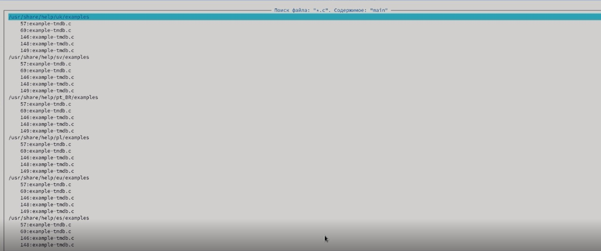
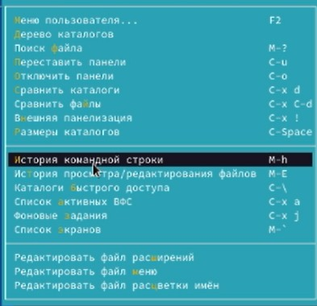
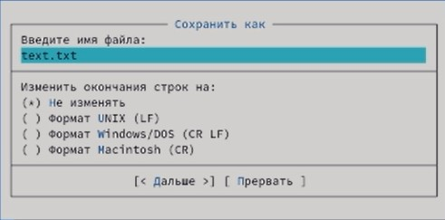
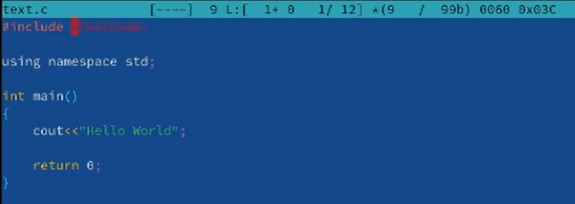
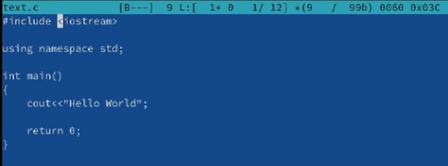

---
# Front matter
lang: ru-RU
title: "Лабораторная работа 7"
subtitle: "Командная оболочка Midnight Commander."
author: "Шеожев Аслан Аскерович"

# Formatting
toc-title: "Содержание"
toc: true # Table of contents
toc_depth: 2
fontsize: 12pt
linestretch: 1.5
papersize: a4paper
documentclass: scrreprt
polyglossia-lang: russian
polyglossia-otherlangs: english
mainfont: PT Serif
romanfont: PT Serif
sansfont: PT Sans
monofont: PT Mono
mainfontoptions: Ligatures=TeX
romanfontoptions: Ligatures=TeX
sansfontoptions: Ligatures=TeX,Scale=MatchLowercase
monofontoptions: Scale=MatchLowercase
indent: true
pdf-engine: lualatex
header-includes:
  - \linepenalty=10 # the penalty added to the badness of each line within a paragraph (no associated penalty node) Increasing the value makes tex try to have fewer lines in the paragraph.
  - \interlinepenalty=0 # value of the penalty (node) added after each line of a paragraph.
  - \hyphenpenalty=50 # the penalty for line breaking at an automatically inserted hyphen
  - \exhyphenpenalty=50 # the penalty for line breaking at an explicit hyphen
  - \binoppenalty=700 # the penalty for breaking a line at a binary operator
  - \relpenalty=500 # the penalty for breaking a line at a relation
  - \clubpenalty=150 # extra penalty for breaking after first line of a paragraph
  - \widowpenalty=150 # extra penalty for breaking before last line of a paragraph
  - \displaywidowpenalty=50 # extra penalty for breaking before last line before a display math
  - \brokenpenalty=100 # extra penalty for page breaking after a hyphenated line
  - \predisplaypenalty=10000 # penalty for breaking before a display
  - \postdisplaypenalty=0 # penalty for breaking after a display
  - \floatingpenalty = 20000 # penalty for splitting an insertion (can only be split footnote in standard LaTeX)
  - \raggedbottom # or \flushbottom
  - \usepackage{float} # keep figures where there are in the text
  - \floatplacement{figure}{H} # keep figures where there are in the text
---

# Отчет по лабораторной работе №7.
### Работу выполнил Шеожев Аслан Аскерович. 

## Цель работы:

Освоение основных возможностей командной оболочки Midnight Commander. Приобретение навыков практической работы по просмотру каталогов и файлов; манипуляций с ними.

## Ход работы:

1. Изучил информацию о mc, вызвав в командной строке man mc.

2. Запустил из командной строки mc, изучил его структуру и меню.

3. Выполнил несколько операций в mc, используя управляющие клавиши (операции с панелями выделение/отмена выделения файлов, копирование/перемещение файлов, получение информации о размере и правах доступа на файлы и/или каталоги и т.п.)

4. Выполнил основные команды меню левой (или правой) панели. Оценил степень
подробности вывода информации о файлах.

5. Используя возможности подменю Файл, выполнил:
* просмотр содержимого текстового файла;
* редактирование содержимого текстового файла (без сохранения результатов редактирования);
* создание каталога;
* копирование в файлов в созданный каталог.

6. С помощью соответствующих средств подменю Команда осуществил:
* поиск в файловой системе файла с заданными условиями (Рис. 1-4);
* выбор и повторение одной из предыдущих команд (Рис. 5);
* переход в домашний каталог;
* анализ файла меню и файла расширений.

Рис. 1 (поиск файла .cpp, содержащего main)

Рис. 2 (результат поиска 1)

Рис. 3 (поиск файла .c, содержащего main)

Рис. 4 (результат поиска 2)

Рис. 5 (историй командной строки)

7. Вызвал подменю Настройки. Освоил операции, определяющие структуру экрана mc (Full screen, Double Width, Show Hidden Files и т.д.).

8. Создал текстовой файл text.txt (Рис. 6).

Рис. 6 (создание нового файла)

9. Открыл этот файл с помощью встроенного в mc редактора.

10. Вставил в открытый файл небольшой фрагмент текста, скопированный из любого другого файла или Интернета.

11. Проделал с текстом следующие манипуляции, используя горячие клавиши:

    11.1. Удалил строку текста.

    11.2. Выделил фрагмент текста и скопировал его на новую строку
    
    11.3. Выделил фрагмент текста и перенес его на новую строку.

    11.4. Сохранил файл.

    11.5. Отменил последнее действие.

    11.6. Перешел в конец файла (нажав комбинацию клавиш) и написал некоторый текст.
    
    11.7. Перешел в начало файла (нажав комбинацию клавиш) и написал некоторый текст.
    
    11.8. Сохранил и закройте файл.

12. Открыл файл с исходным текстом на некотором языке программирования (например C или Java)

13. Используя меню редактора, включил подсветку синтаксиса (Рис. 7-8).

Рис. 7 (включение подсветки)

Рис. 8 (выключение подсветки)

## Вывод:

Я освоил основные возможности командной оболочки Midnight Commander. Приобрел навыки практической работы по просмотру каталогов и файлов; манипуляций с ними.