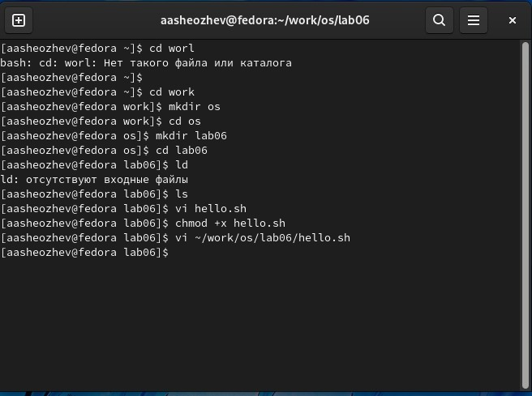
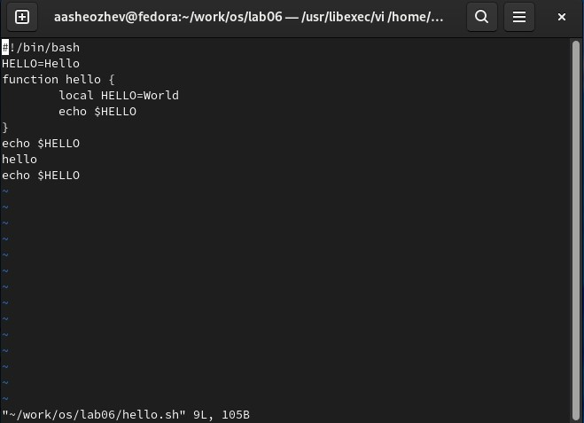

# ***Презентация по лабораторной работе №8***
###### **Работу выполнил Шеожев Аслан Аскерович**
<!-- _backgroundColor: #0000 -->
---
# Цель работы:
Познакомиться с операционной системой Linux. Получить практические навыки работы с редактором vi, установленным по умолчанию практически во всех дистрибутивах.
<!-- _backgroundColor: #bfccbe -->
---
<!-- _backgroundColor: #bfccbe -->
# Ход работы:
1. Создал каталог с именем ~/work/os/lab06.
2. Перешел во вновь созданный каталог.
3. Вызвал vi и создайте файл hello.sh
4. Нажал клавишу i и ввел текст из условия.
5. Нажал клавишу Esc для перехода в командный режим после завершения ввода текста.
6. Нажал : для перехода в режим последней строки и внизу экрана появилось приглашение в виде двоеточия.
7. Нажал w (записать) и q (выйти), а затем нажал клавишу Enter для сохранения текста и завершения работы.
8. Сделал файл исполняемым.
---

9. Вызвал vi на редактирование файла
10. Установил курсор в конец слова HELL второй строки.
11. Перешел в режим вставки и заменил на HELLO. Нажпл Esc для возврата в командный режим.
12. Установил курсор на четвертую строку и стер слово LOCAL.
13. Перешел в режим вставки и набрал текст из условия, нажал Esc для возврата в командный режим.
14. Установил курсор на последней строке файла. Вставил после неё строку, содержащую текст: echo $HELLO.
15. Нажал Esc для перехода в командный режим.
16. Удалил последнюю строку.
17. Ввел команду отмены изменений u для отмены последней команды.
18. Ввел символ : для перехода в режим последней строки. Записал произведённые изменения и вышел из vi.
<!-- _backgroundColor: #bfccbe -->
---

Рис. 1 командная строка по итогу
<!-- _backgroundColor: #bfccbe -->
---

<!-- _backgroundColor: #bfccbe -->
Рис. 2 файл по итогу

---

# Вывод:

Я познакомился с операционной системой Linux. Получил практические навыки работы с редактором vi, установленным по умолчанию практически во всех дистрибутивах.
<!-- _backgroundColor: #bfccbe -->