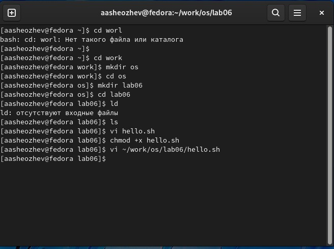
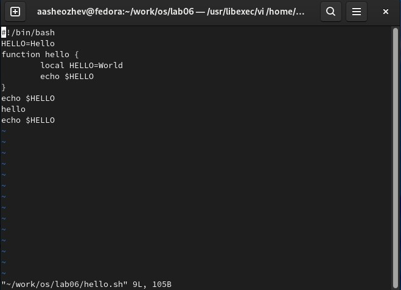

---
# Front matter
lang: ru-RU
title: "Лабораторная работа 8"
subtitle: "Текстовой редактор vi."
author: "Шеожев Аслан Аскерович"

# Formatting
toc-title: "Содержание"
toc: true # Table of contents
toc_depth: 2
fontsize: 12pt
linestretch: 1.5
papersize: a4paper
documentclass: scrreprt
polyglossia-lang: russian
polyglossia-otherlangs: english
mainfont: PT Serif
romanfont: PT Serif
sansfont: PT Sans
monofont: PT Mono
mainfontoptions: Ligatures=TeX
romanfontoptions: Ligatures=TeX
sansfontoptions: Ligatures=TeX,Scale=MatchLowercase
monofontoptions: Scale=MatchLowercase
indent: true
pdf-engine: lualatex
header-includes:
  - \linepenalty=10 # the penalty added to the badness of each line within a paragraph (no associated penalty node) Increasing the value makes tex try to have fewer lines in the paragraph.
  - \interlinepenalty=0 # value of the penalty (node) added after each line of a paragraph.
  - \hyphenpenalty=50 # the penalty for line breaking at an automatically inserted hyphen
  - \exhyphenpenalty=50 # the penalty for line breaking at an explicit hyphen
  - \binoppenalty=700 # the penalty for breaking a line at a binary operator
  - \relpenalty=500 # the penalty for breaking a line at a relation
  - \clubpenalty=150 # extra penalty for breaking after first line of a paragraph
  - \widowpenalty=150 # extra penalty for breaking before last line of a paragraph
  - \displaywidowpenalty=50 # extra penalty for breaking before last line before a display math
  - \brokenpenalty=100 # extra penalty for page breaking after a hyphenated line
  - \predisplaypenalty=10000 # penalty for breaking before a display
  - \postdisplaypenalty=0 # penalty for breaking after a display
  - \floatingpenalty = 20000 # penalty for splitting an insertion (can only be split footnote in standard LaTeX)
  - \raggedbottom # or \flushbottom
  - \usepackage{float} # keep figures where there are in the text
  - \floatplacement{figure}{H} # keep figures where there are in the text
---

# Отчет по лабораторной работе №8.
### Работу выполнил Шеожев Аслан Аскерович. 

## Цель работы:

Познакомиться с операционной системой Linux. Получить практические навыки работы с редактором vi, установленным по умолчанию практически во всех дистрибутивах.

## Ход работы:

### В скриншотах по итогу прикрепленны конечный вид vi и командной строки (Рис. 1-2).

1. Создал каталог с именем ~/work/os/lab06.
2. Перешел во вновь созданный каталог.
3. Вызвал vi и создайте файл hello.sh
4. Нажал клавишу i и ввел текст из условия.
5. Нажал клавишу Esc для перехода в командный режим после завершения ввода текста.
6. Нажал : для перехода в режим последней строки и внизу экрана появилось приглашение в виде двоеточия.
7. Нажал w (записать) и q (выйти), а затем нажал клавишу Enter для сохранения текста и завершения работы.
8. Сделал файл исполняемым
9. Вызвал vi на редактирование файла
10. Установил курсор в конец слова HELL второй строки.
11. Перешел в режим вставки и заменил на HELLO. Нажпл Esc для возврата в командный режим.
12. Установил курсор на четвертую строку и стер слово LOCAL.
13. Перешел в режим вставки и набрал текст из условия, нажал Esc для возврата в командный режим.
14. Установил курсор на последней строке файла. Вставил после неё строку, содержащую текст: echo $HELLO.
15. Нажал Esc для перехода в командный режим.
16. Удалил последнюю строку.
17. Ввел команду отмены изменений u для отмены последней команды.
18. Ввел символ : для перехода в режим последней строки. Записал произведённые изменения и вышел из vi.

Рис. 1 командная строка по итогу

Рис. 2 файл по итогу

## Вывод:

Я познакомился с операционной системой Linux. Получил практические навыки работы с редактором vi, установленным по умолчанию практически во всех дистрибутивах.

## Контрольные вопросы:

1. В редакторе vi есть два основных режима: командный режим и режим вставки. По умолчанию работа начинается в командном режиме.

2. в командном режиме набрать q или q! и нажать enter

3. 
* 0 (ноль) — переход в начало строки;

* $ — переход в конец строки;

* G — переход в конец файла;

* n G — переход на строку с номером n.

5. 
* G - переход в конец файла
* 1 G - переход в начало файла
6. 
    – : n,m d — удалить строки с n по m;

    – : i,j m k — переместить строки с i по j, начиная со строки k;

    – : i,j t k — копировать строки с i по j в строку k;

    – : i,j w имя-файла — записать строки с i по j в файл с именем имя-файла.

    – : w — записать изменённый текст в файл, не выходя из vi;

    – : w имя-файла — записать изменённый текст в новый файл с именем имя-файла;

    – : w ! имя-файла — записать изменённый текст в файл с именем имя-файла;

    – : w q — записать изменения в файл и выйти из vi;

    – : q — выйти из редактора vi;

    – : q ! — выйти из редактора без записи;

    – : e ! — вернуться в командный режим, отменив все изменения, произведённые со времени последней записи.

7. c$ $

8. 
* esc -> u -> enter

12. В командном режиме нельзя редактировать текст