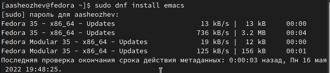
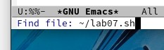

 # ***Презентация по лабораторной работе №9***
 ###### **Работу выполнил Шеожев Аслан Аскерович**
<!-- _backgroundColor: #fffacd -->
---
# Цель работы:
* Познакомиться с операционной системой Linux. Получить практические навыки работы с редактором Emacs.
<!-- _backgroundColor: #ffdab9 -->
---
<!-- _backgroundColor: #ffdead -->
# Ход работы:
1. Скачал и открыл emacs. (Рис. 1)

 

Рис. 1 (скачал emacs)

2. Создал файл lab07.sh с помощью комбинации Ctrl-x Ctrl-f (C-x C-f). (Рис. 2)

Рис. 2 (создал lab07.sh)

3. Набрал текст из лабораторной работы.
---
4. Сохранил файл с помощью комбинации Ctrl-x Ctrl-s (C-x C-s).

5. Проделал с текстом стандартные процедуры редактирования, каждое действие осуществлялось комбинацией клавиш.

    5.1. Вырезал одной командой целую строку (С-k).

    5.2. Вставил эту строку в конец файла (C-y).
  
    5.3. Выделил область текста (C-space).
  
    5.4. Скопировал область в буфер обмена (M-w).
    
    5.5. Вставил область в конец файла.
    
    5.6. Вновь выделил эту область и на этот раз вырезать её (C-w).
    
    5.7. Отменил последнее действие (C-/).
<!-- _backgroundColor: #ffdead -->
---
<!-- _backgroundColor: #ffdead -->
6. Научился использовать команды по перемещению курсора, выполнив следующие действия:

    6.1. Переместил курсор в начало строки (C-a).
    
    6.2. Переместил курсор в конец строки (C-e).
    
    6.3. Переместил курсор в начало буфера (M-<).
    
    6.4. Переместил курсор в конец буфера (M->).

7. Управление буферами.

    7.1. Вывел список активных буферов на экран (C-x C-b).

    7.2. Переместился во вновь открытое окно (C-x) со списком открытых буферов и переключился на другой буфер.

    7.3. Закрыл это окно (C-x 0).
    
    7.4. Затем вновь переключался между буферами, но уже без вывода их списка на экран (C-x b).

---

<!-- _backgroundColor: #ffdead -->
8. Управление окнами.

    8.1. Поделил фрейм на 4 части: разделил фрейм на два окна по вертикали (C-x 3), а затем каждое из этих окон на две части по горизонтали (C-x 2).
    8.2. В каждом из четырёх созданных окон открыл новый буфер (файл) и ввел несколько строк текста.
9. Режим поиска
    9.1. Переключился в режим поиска (C-s) и нашел несколько слов, присутствующих в тексте.
    9.2. Переключился между результатами поиска, нажимая C-s.
    9.3. Вышел из режима поиска, нажав C-g.
    9.4. Перешел в режим поиска и замены (M-%), ввел текст, который следует найти и заменить, нажал Enter , затем ввел текст для замены, нажал ! для подтверждения замены.
    9.5. Испробовал другой режим поиска, нажав M-s o.

---
# Вывод:
<!-- _backgroundColor: #c0c0c0 -->
* Я познакомился с операционной системой Linux. Получил практические навыки работы с редактором Emacs