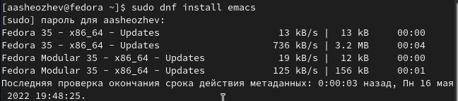
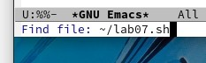
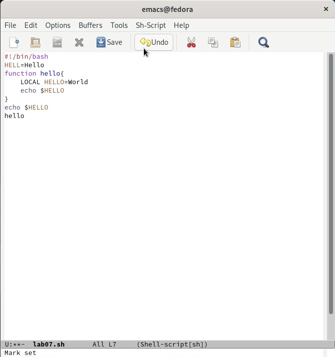
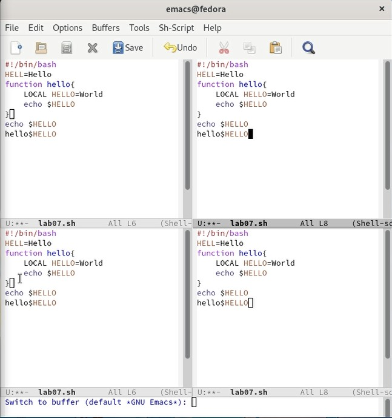

---
# Front matter
lang: ru-RU
title: "Лабораторная работа 9"
subtitle: "Текстовой редактор emacs"
author: "Шеожев Аслан Аскерович"

# Formatting
toc-title: "Содержание"
toc: true # Table of contents
toc_depth: 2
fontsize: 12pt
linestretch: 1.5
papersize: a4paper
documentclass: scrreprt
polyglossia-lang: russian
polyglossia-otherlangs: english
mainfont: PT Serif
romanfont: PT Serif
sansfont: PT Sans
monofont: PT Mono
mainfontoptions: Ligatures=TeX
romanfontoptions: Ligatures=TeX
sansfontoptions: Ligatures=TeX,Scale=MatchLowercase
monofontoptions: Scale=MatchLowercase
indent: true
pdf-engine: lualatex
header-includes:
  - \linepenalty=10 # the penalty added to the badness of each line within a paragraph (no associated penalty node) Increasing the value makes tex try to have fewer lines in the paragraph.
  - \interlinepenalty=0 # value of the penalty (node) added after each line of a paragraph.
  - \hyphenpenalty=50 # the penalty for line breaking at an automatically inserted hyphen
  - \exhyphenpenalty=50 # the penalty for line breaking at an explicit hyphen
  - \binoppenalty=700 # the penalty for breaking a line at a binary operator
  - \relpenalty=500 # the penalty for breaking a line at a relation
  - \clubpenalty=150 # extra penalty for breaking after first line of a paragraph
  - \widowpenalty=150 # extra penalty for breaking before last line of a paragraph
  - \displaywidowpenalty=50 # extra penalty for breaking before last line before a display math
  - \brokenpenalty=100 # extra penalty for page breaking after a hyphenated line
  - \predisplaypenalty=10000 # penalty for breaking before a display
  - \postdisplaypenalty=0 # penalty for breaking after a display
  - \floatingpenalty = 20000 # penalty for splitting an insertion (can only be split footnote in standard LaTeX)
  - \raggedbottom # or \flushbottom
  - \usepackage{float} # keep figures where there are in the text
  - \floatplacement{figure}{H} # keep figures where there are in the text
---

# Отчет по лабораторной работе №9.
### Работу выполнил Шеожев Аслан Аскерович. 

## Цель работы:

Познакомиться с операционной системой Linux. Получить практические навыки работы с редактором Emacs.

## Ход работы:
1. Скачал и открыл emacs. (Рис. 1)

 

Рис. 1 (скачал emacs)

2. Создал файл lab07.sh с помощью комбинации Ctrl-x Ctrl-f (C-x C-f). (Рис. 2)

Рис. 2 (создал lab07.sh)

3. Набрал текст из лабораторной работы. (Рис. 3)

 

Рис. 3 (набор текст)

4. Сохранил файл с помощью комбинации Ctrl-x Ctrl-s (C-x C-s).

5. Проделал с текстом стандартные процедуры редактирования, каждое действие осуществлялось комбинацией клавиш.

    5.1. Вырезал одной командой целую строку (С-k).

    5.2. Вставил эту строку в конец файла (C-y).
  
    5.3. Выделил область текста (C-space).
  
    5.4. Скопировал область в буфер обмена (M-w).
    
    5.5. Вставил область в конец файла.
    
    5.6. Вновь выделил эту область и на этот раз вырезать её (C-w).
    
    5.7. Отменил последнее действие (C-/).

6. Научился использовать команды по перемещению курсора, выполнив следующие действия:

    6.1. Переместил курсор в начало строки (C-a).
    
    6.2. Переместил курсор в конец строки (C-e).
    
    6.3. Переместил курсор в начало буфера (M-<).
    
    6.4. Переместил курсор в конец буфера (M->).

7. Управление буферами.

    7.1. Вывел список активных буферов на экран (C-x C-b).

    7.2. Переместился во вновь открытое окно (C-x) со списком открытых буферов и переключился на другой буфер.

    7.3. Закрыл это окно (C-x 0).
    
    7.4. Затем вновь переключался между буферами, но уже без вывода их списка на экран (C-x b).

8. Управление окнами.

    8.1. Поделил фрейм на 4 части: разделил фрейм на два окна по вертикали (C-x 3), а затем каждое из этих окон на две части по горизонтали (C-x 2) (Рис. 4).

     

    Рис. 4 (выполнение пункта 8.1)

    8.2. В каждом из четырёх созданных окон открыл новый буфер (файл) и ввел несколько строк текста.

9. Режим поиска
    9.1. Переключился в режим поиска (C-s) и нашел несколько слов, присутствующих в тексте.

    9.2. Переключился между результатами поиска, нажимая C-s.

    9.3. Вышел из режима поиска, нажав C-g.

    9.4. Перешел в режим поиска и замены (M-%), ввел текст, который следует найти и заменить, нажал Enter , затем ввел текст для замены, нажал ! для подтверждения замены.
    
    9.5. Испробовал другой режим поиска, нажав M-s o.

## Вывод:

Я познакомился с операционной системой Linux. Получил практические навыки работы с редактором Emacs

## Контрольные вопросы:

1. Редактор обладает возможностью изменять текст, а также некоторыми удобными функциями, к примеру поиск текста.

2. Огромное число команд, некоторые из которых непонятно как использовать горячими клавишами.

3. Окно - отображение буфера. Буфер - текст.

4. В одном окне отображается один буфер, соответственно 10 буферов в одном окне открыть нельзя.

5. GNU Emacs, Messages, scratch.

6. ctrl + c + |

7. c-x 2

8. В файле .emacs

9. Удаление предыдущего символа

10. Удобнее было использовать emacs, так как в нём больше функций и удобнее интерфейс.