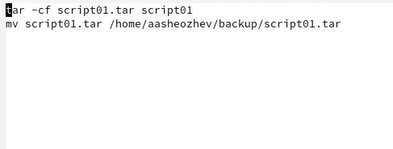
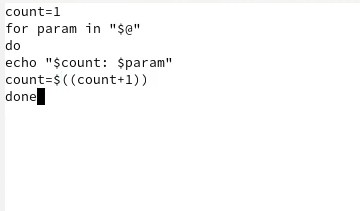
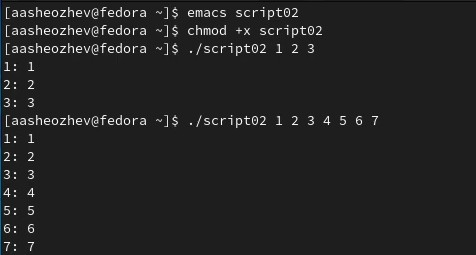
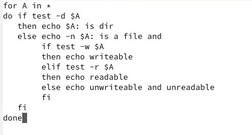
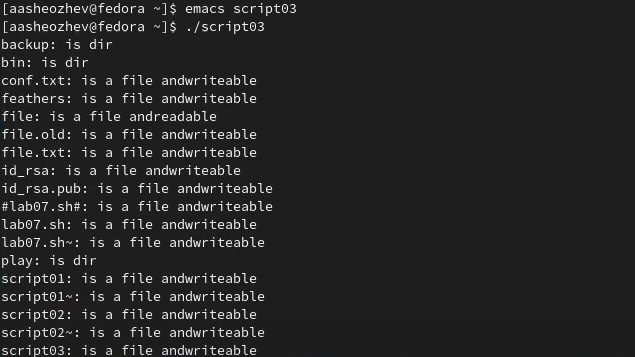
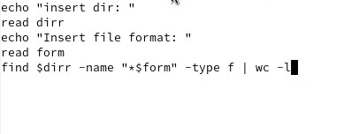
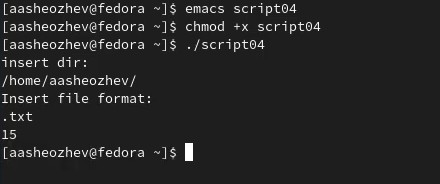

 # ***Презентация по лабораторной работе №10***
 ###### **Работу выполнил Шеожев Аслан Аскерович**
<!-- _backgroundColor: #fffacd -->
---
# Цель работы:
<!-- _backgroundColor: #ffdead -->
* Изучить основы программирования в оболочке ОС UNIX/Linux. Научиться писать небольшие командные файлы.

---

## Ход работы:
<!-- _backgroundColor: #ffdead -->
1. Написал скрипт, который при запуске будет делал резервную копию самого себя в другую директорию backup в вашем домашнем каталоге. При этом файл должен архивировался tar. (Рис. 1)
 
Рис. 1 (Написание 1 программы)

---
<!-- _backgroundColor: #ffdead -->
2. Написал пример командного файла, обрабатывающего любое произвольное число аргументов командной строки, в том числе превышающее десять. (Рис. 2.1-2.2)
 
Рис. 2.1 (Написание 2 программы)
 
Рис. 2.2 (Запуск 2 программы)

---

3. Написал командный файл — аналог команды ls, который выдавает информацию о нужном каталоге и выводит информацию о возможностях доступа к файлам этого каталога. (Рис. 3.1-3.2)
 
Рис. 3.1 (Написание 3 программы)
<!-- _backgroundColor: #ffdead -->

---

 
<!-- _backgroundColor: #ffdead -->
Рис. 3.2 (Запуск 3 программы)

---

4. Написал командный файл, который получает в качестве аргумента командной строки формат файла и вычисляет количество таких файлов в указанной директории. Путь к директории также передаётся в виде аргумента командной строки.
 
Рис. 4.1 (Написание 4 программы)
 
Рис. 4.2 (Запуск 4 программы)
<!-- _backgroundColor: #ffdead -->
---

## Вывод:

* Я изучил основы программирования в оболочке ОС UNIX/Linux, а также научился писать небольшие командные файлы.
<!-- _backgroundColor: #c0c0c0 -->