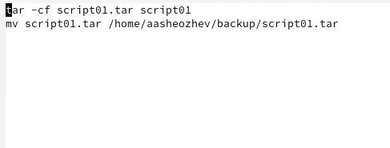
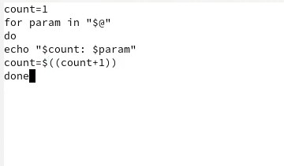
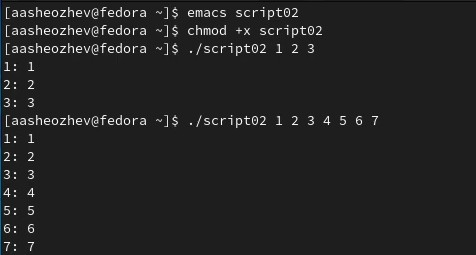
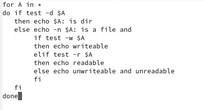
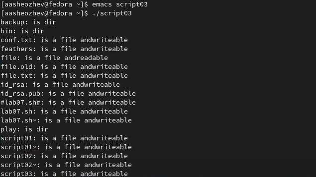
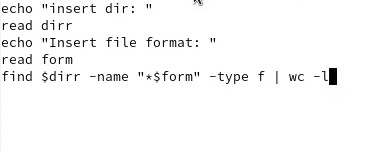
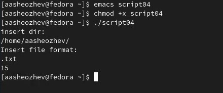

---
# Front matter
lang: ru-RU
title: "Лабораторная работа 10"
subtitle: "Программирование в командном процессоре ОС UNIX. Командные файлы."
author: "Шеожев Аслан Аскерович"

# Formatting
toc-title: "Содержание"
toc: true # Table of contents
toc_depth: 2
fontsize: 12pt
linestretch: 1.5
papersize: a4paper
documentclass: scrreprt
polyglossia-lang: russian
polyglossia-otherlangs: english
mainfont: PT Serif
romanfont: PT Serif
sansfont: PT Sans
monofont: PT Mono
mainfontoptions: Ligatures=TeX
romanfontoptions: Ligatures=TeX
sansfontoptions: Ligatures=TeX,Scale=MatchLowercase
monofontoptions: Scale=MatchLowercase
indent: true
pdf-engine: lualatex
header-includes:
  - \linepenalty=10 # the penalty added to the badness of each line within a paragraph (no associated penalty node) Increasing the value makes tex try to have fewer lines in the paragraph.
  - \interlinepenalty=0 # value of the penalty (node) added after each line of a paragraph.
  - \hyphenpenalty=50 # the penalty for line breaking at an automatically inserted hyphen
  - \exhyphenpenalty=50 # the penalty for line breaking at an explicit hyphen
  - \binoppenalty=700 # the penalty for breaking a line at a binary operator
  - \relpenalty=500 # the penalty for breaking a line at a relation
  - \clubpenalty=150 # extra penalty for breaking after first line of a paragraph
  - \widowpenalty=150 # extra penalty for breaking before last line of a paragraph
  - \displaywidowpenalty=50 # extra penalty for breaking before last line before a display math
  - \brokenpenalty=100 # extra penalty for page breaking after a hyphenated line
  - \predisplaypenalty=10000 # penalty for breaking before a display
  - \postdisplaypenalty=0 # penalty for breaking after a display
  - \floatingpenalty = 20000 # penalty for splitting an insertion (can only be split footnote in standard LaTeX)
  - \raggedbottom # or \flushbottom
  - \usepackage{float} # keep figures where there are in the text
  - \floatplacement{figure}{H} # keep figures where there are in the text
---

# Отчет по лабораторной работе №10.
### Работу выполнил Шеожев Аслан Аскерович. 

## Цель работы:

* Изучить основы программирования в оболочке ОС UNIX/Linux. Научиться писать небольшие командные файлы.

## Ход работы:

1. Написал скрипт, который при запуске будет делал резервную копию самого себя в другую директорию backup в вашем домашнем каталоге. При этом файл должен архивировался tar. (Рис. 1)

 

Рис. 1 (Написание 1 программы)

2. Написал пример командного файла, обрабатывающего любое произвольное число аргументов командной строки, в том числе превышающее десять. (Рис. 2.1-2.2)

 

Рис. 2.1 (Написание 2 программы)

 

Рис. 2.2 (Запуск 2 программы)

3. Написал командный файл — аналог команды ls, который выдавает информацию о нужном каталоге и выводит информацию о возможностях доступа к файлам этого каталога. (Рис. 3.1-3.2)

 

Рис. 3.1 (Написание 3 программы)

 

Рис. 3.2 (Запуск 3 программы)

4. Написал командный файл, который получает в качестве аргумента командной строки формат файла и вычисляет количество таких файлов в указанной директории. Путь к директории также передаётся в виде аргумента командной строки.

 

Рис. 4.1 (Написание 4 программы)

 

Рис. 4.2 (Запуск 4 программы)

## Вывод:

* Я изучил основы программирования в оболочке ОС UNIX/Linux, а также научился писать небольшие командные файлы.