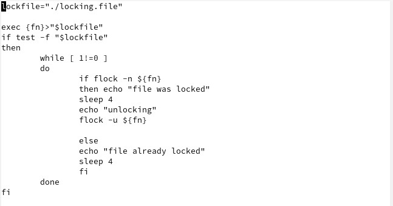
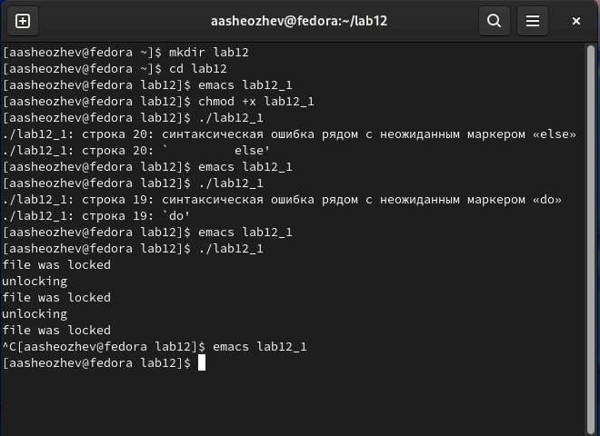
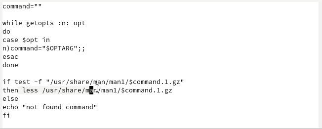
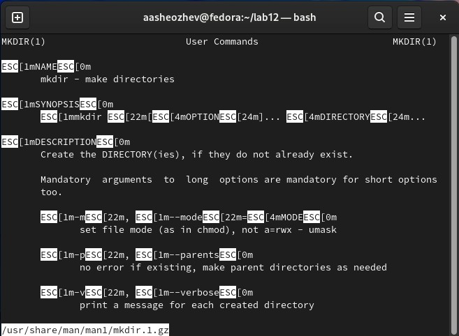
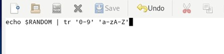
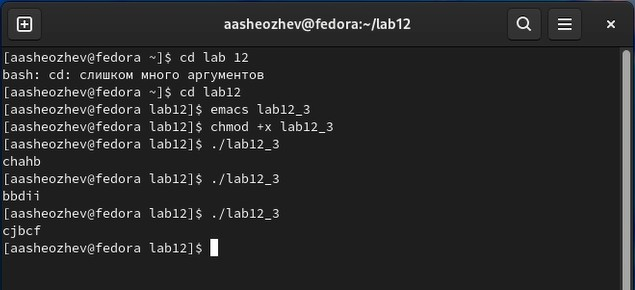

 # ***Презентация по лабораторной работе №12***
 ###### **Работу выполнил Шеожев Аслан Аскерович**

<!-- _backgroundColor: #fffacd -->

---
# Цель работы:

<!-- _backgroundColor: #ffdead -->
* Изучить основы программирования в оболочке ОС UNIX. Научиться писать более сложные командные файлы с использованием логических управляющих конструкций и циклов.

---

## Ход работы:
<!-- _backgroundColor: #ffdead -->
1. Написал командный файл, реализующий упрощённый механизм семафоров. Командный файл в течение некоторого времени t1 дожидался освобождения ресурса, выдавая об этом сообщение, а дождавшись его освобождения, использовал его в течение некоторого времени t2<>t1, также выдавая информацию о том, что ресурс используется соответствующим командным файлом (процессом). Запустил командный файл в одном виртуальном терминале в фоновом режиме, перенаправив его вывод в другой (> /dev/tty#, где # — номер терминала куда перенаправляется вывод), в котором также запущен этот файл, но не фоновом, а в привилегированном режиме. Доработал программу так, чтобы появилась возможность взаимодействия трёх и более процессов. (Рис. 1-2)

---

 
<!-- _backgroundColor: #ffdead -->

Рис. 1 (Командный файл для 1 пункта)

---

 
<!-- _backgroundColor: #ffdead -->

Рис. 2 (Результат вывода 1 программы)

---

2. Реализовал команду man с помощью командного файла. Изучил содержимое каталога /usr/share/man/man1. В нем находятся архивы текстовых файлов, содержащих справку по большинству установленных в системе программ и команд. Каждый архив можно открыть командой less сразу же просмотрев содержимое справки. Командный файл должен получал в виде аргумента командной строки название команды и в виде результата выдавать справку об этой команде или сообщение об отсутствии справки, если соответствующего файла нет в каталоге man1. (Рис. 3-4)
<!-- _backgroundColor: #ffdead -->

---

 

Рис. 3 (Командный файл для 2 пункта)
<!-- _backgroundColor: #ffdead -->

---

 

Рис. 4 (Результат вывода 2 программы)
<!-- _backgroundColor: #ffdead -->

---

3. Используя встроенную переменную $RANDOM, написал командный файл, генерирующий случайную последовательность букв латинского алфавита. (Рис.5-6)

 
<!-- _backgroundColor: #ffdead -->

Рис. 5 (Командный файл для 3 пункта)

---

 

Рис. 6 (Результат вывода 3 программы)
<!-- _backgroundColor: #ffdead -->

---

## Вывод:

* Я изучил основы программирования в оболочке ОС UNIX. Научился писать более сложные командные файлы с использованием логических управляющих конструкций и циклов.

<!-- _backgroundColor: #c0c0c0 -->