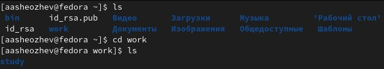
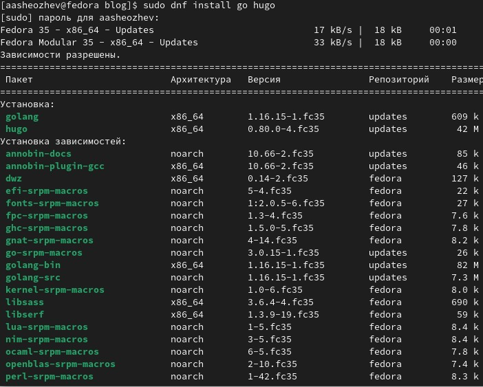
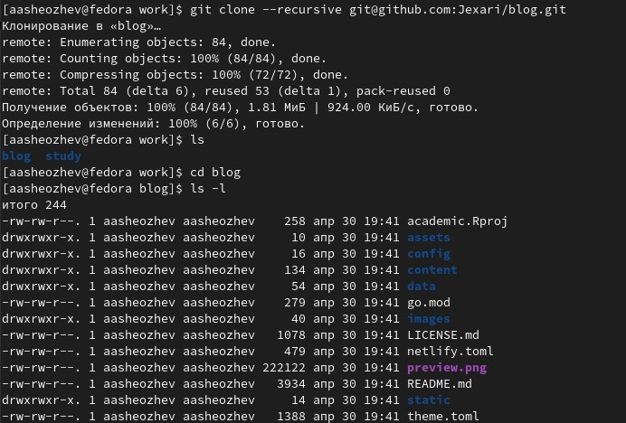
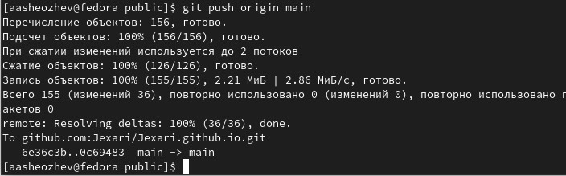

 # ***Первый этап индивидуального проекта***
 ###### **Работу выполнил Шеожев Аслан Аскерович**
<!-- _backgroundColor: #bfccbe -->
 ---
 # Цель работы:
 * Разместить на Github pages заготовки для персонального сайта.
<!-- _backgroundColor: #bfccbe -->
---

Рис. 1 (подготовительная работа)
<!-- _backgroundColor: #bfccbe -->
---
<!-- _backgroundColor: #bfccbe -->
**Ход работы:**
1. Установил необходимое программное обеспечение.

Рис. 2 (установка Hugo)
---
<!-- _backgroundColor: #bfccbe -->
2. Скачал шаблон темы сайта.
 
Рис. 3 (скачивание шаблона темы сайта)
---
<!-- _backgroundColor: #bfccbe -->

3. Разместил его на хостинге git.
4. Установил параметр для URLs сайта.
5. Разместил заготовку сайта на Github pages.

Рис. 4 (загрузка на github)
---
# Вывод:
<!-- _backgroundColor: #bfccbe -->
Были получены знания по основам Hugo, а также по размещению сайта на Github.