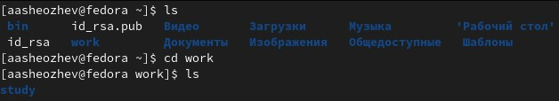
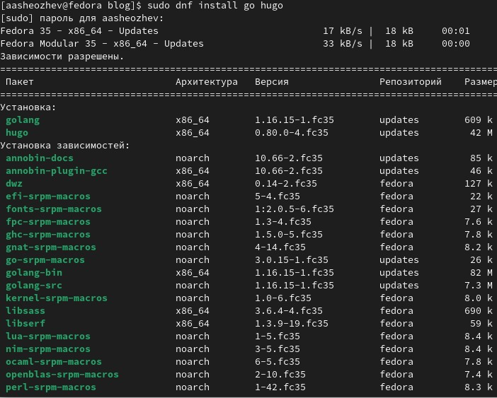
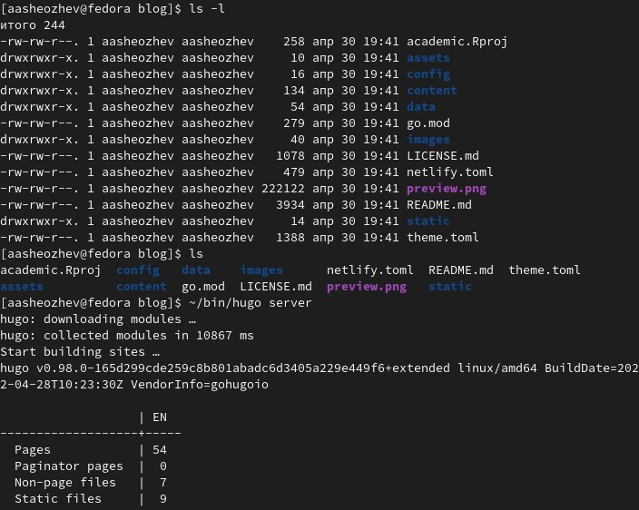
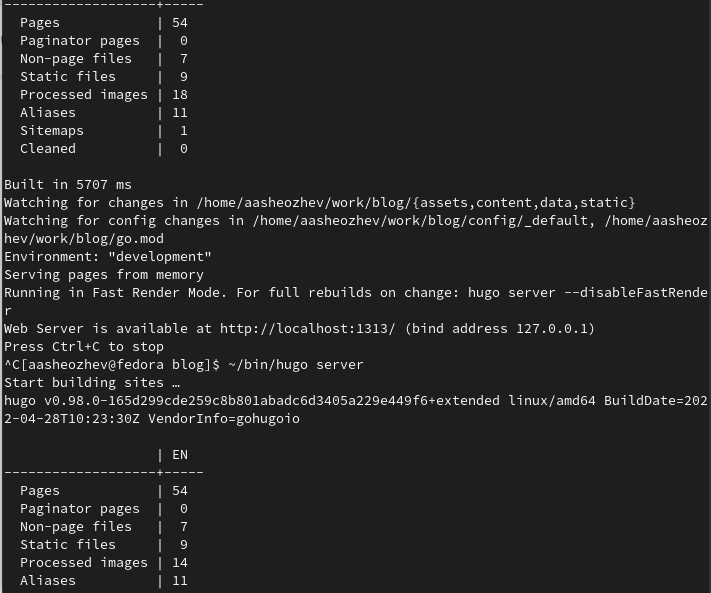
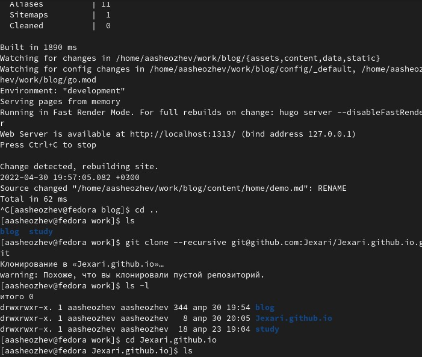
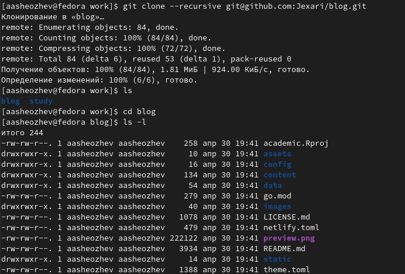
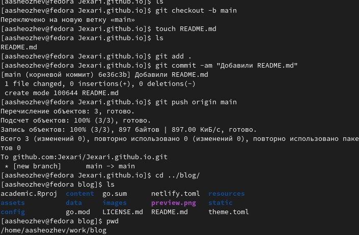
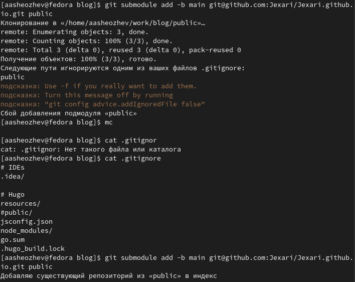
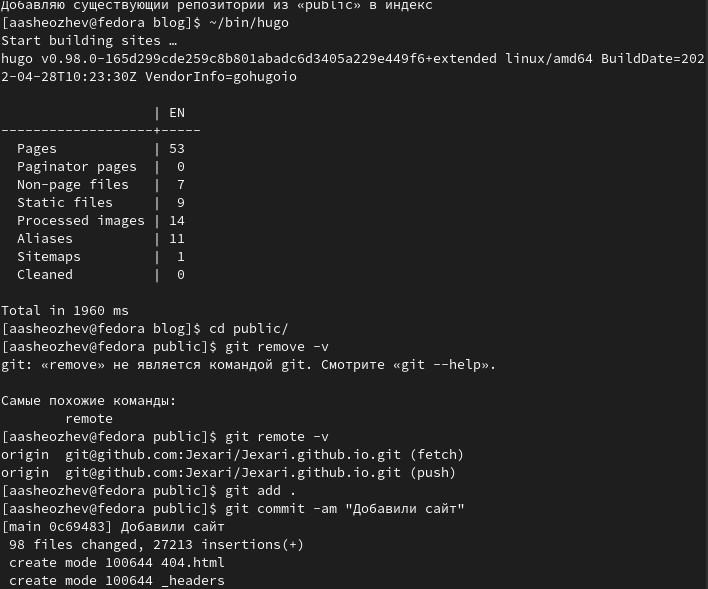
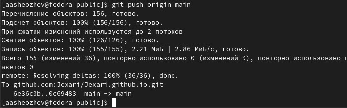

---
# Front matter
lang: ru-RU
title: "Отчет по индивидуальному проекту"
subtitle: "Размещение на Github pages заготовки для персонального сайта."
author: "Шеожев Аслан Аскерович"

# Formatting
toc-title: "Содержание"
toc: true # Table of contents
toc_depth: 2
fontsize: 12pt
linestretch: 1.5
papersize: a4paper
documentclass: scrreprt
polyglossia-lang: russian
polyglossia-otherlangs: english
mainfont: PT Serif
romanfont: PT Serif
sansfont: PT Sans
monofont: PT Mono
mainfontoptions: Ligatures=TeX
romanfontoptions: Ligatures=TeX
sansfontoptions: Ligatures=TeX,Scale=MatchLowercase
monofontoptions: Scale=MatchLowercase
indent: true
pdf-engine: lualatex
header-includes:
  - \linepenalty=10 # the penalty added to the badness of each line within a paragraph (no associated penalty node) Increasing the value makes tex try to have fewer lines in the paragraph.
  - \interlinepenalty=0 # value of the penalty (node) added after each line of a paragraph.
  - \hyphenpenalty=50 # the penalty for line breaking at an automatically inserted hyphen
  - \exhyphenpenalty=50 # the penalty for line breaking at an explicit hyphen
  - \binoppenalty=700 # the penalty for breaking a line at a binary operator
  - \relpenalty=500 # the penalty for breaking a line at a relation
  - \clubpenalty=150 # extra penalty for breaking after first line of a paragraph
  - \widowpenalty=150 # extra penalty for breaking before last line of a paragraph
  - \displaywidowpenalty=50 # extra penalty for breaking before last line before a display math
  - \brokenpenalty=100 # extra penalty for page breaking after a hyphenated line
  - \predisplaypenalty=10000 # penalty for breaking before a display
  - \postdisplaypenalty=0 # penalty for breaking after a display
  - \floatingpenalty = 20000 # penalty for splitting an insertion (can only be split footnote in standard LaTeX)
  - \raggedbottom # or \flushbottom
  - \usepackage{float} # keep figures where there are in the text
  - \floatplacement{figure}{H} # keep figures where there are in the text
---

# Отчет по первому этапу индивидуального проекта (Размещение на Github pages заготовки для персонального сайта).
## Работу выполнил Шеожев Аслан Аскерович.

# Цель работы:

Разместить на Github pages заготовки для персонального сайта.

# Ход работы:

1. Установил необходимое программное обеспечение.

 { width=100% } Рис. 1 (подготовительная работа)

 { width=100% } Рис. 2 (установка Hugo 1)

 { width=100% } Рис. 3 (установка Hugo 2)

 { width=100% } Рис. 4 (установка Hugo 3)

 { width=100% } Рис. 5 (установка Hugo 4)

2. Скачал шаблон темы сайта.

 { width=100% } Рис. 6 (скачивание шаблона темы сайта)

3. Разместил его на хостинге git.

 { width=100% } Рис. 7 (загрузка на github 1)

 { width=100% } Рис. 8 (загрузка на github 2)

 { width=100% } Рис. 9 (загрузка на github 3)

 { width=100% } Рис. 10 (загрузка на github 4)

4. Установил параметр для URLs сайта.

5. Разместил заготовку сайта на Github pages.

Ссылка на сайт: https://jexari.github.io/

# Вывод:
Были получены знания по основам Hugo, а также по размещению сайта на Github.