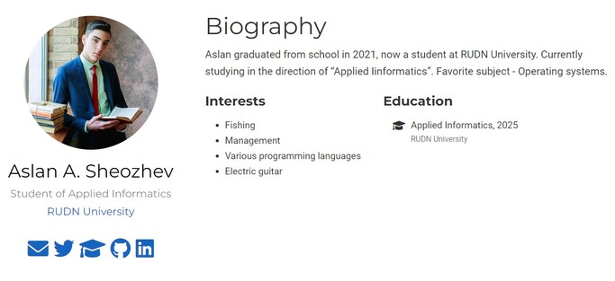
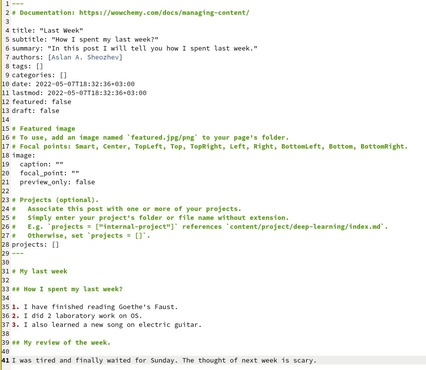
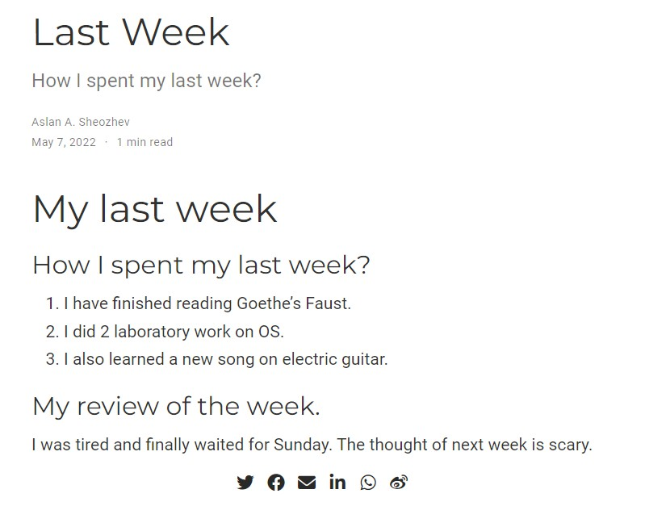
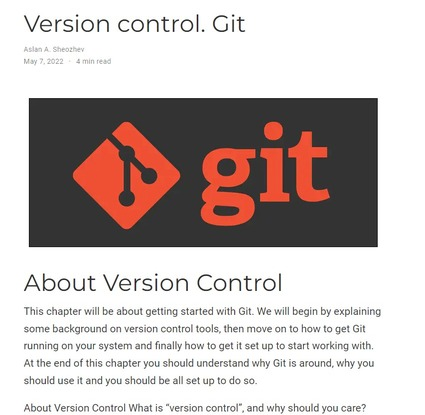

# ***Презентация по 2 этапу индивидуального проекта***
###### **Работу выполнил Шеожев Аслан Аскерович**
<!-- _backgroundColor: #11ffee00 -->
---
# Цель работы:
Добавление информации о себе на сайт.

<!-- _backgroundColor: #bfccbe -->
---
<!-- _backgroundColor: #bfccbe -->
## Ход работы:
1. Список добавленных данных (Рис. 1, 2, 3):
* Разместил фотографию владельца сайта.
* Разместил краткое описание владельца сайта (Biography).
* Добавил информацию об интересах (Interests).
* Добавил информацию от образовании (Education).

Рис. 1 Добавление информации о себе

---

### 2. Сделал пост по прошедшей неделе (Рис. 2-3).

Рис. 2 Пост о предыдущей неделе 1
<!-- _backgroundColor: #bfccbe -->
---

Рис. 3 Пост о предыдущей неделе 2
<!-- _backgroundColor: #bfccbe -->

---
### 3. Добавил пост на тему "Управление версиями. Git." (Рис. 4)

Рис. 4 Пост на тему "Управление версиями. Git."
<!-- _backgroundColor: #bfccbe -->
---

# Вывод:
Мною были приобретены навыки изменения основной информации на сайте, а также её добавление.

<!-- _backgroundColor: #bfccbe -->