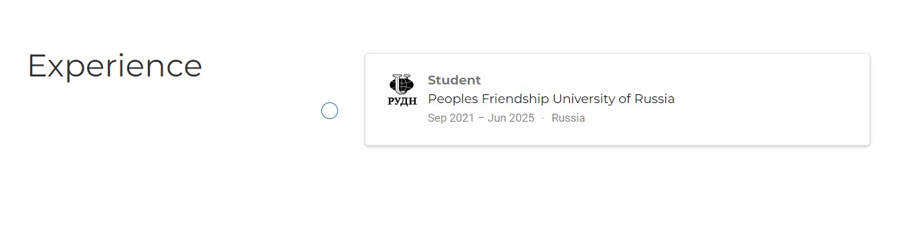

# ***Презентация по 3 этапу индивидуального проекта***
###### **Работу выполнил Шеожев Аслан Аскерович**
<!-- _backgroundColor: #11ffee00 -->
---
# Цель работы:

Добавить к сайту достижения.

<!-- _backgroundColor: #bfccbe -->
---
<!-- _backgroundColor: #bfccbe -->
## Ход работы:

* Добавил информацию о навыках (Skills) (Рис. 1).

Рис. 1 Skills
<!-- _backgroundColor: #bfccbe -->
---

* Добавил информацию об опыте (Experience) (Рис. 2).
<!-- _backgroundColor: #bfccbe -->

Рис. 2 Experience

---

* Добавил информацию о достижениях (Accomplishments) (Рис. 3).
<!-- _backgroundColor: #bfccbe -->

Рис. 3 Accomplishments

---

###### Сделал пост по прошедшей неделе (Рис. 4).
<!-- _backgroundColor: #bfccbe -->
 Рис. 4 Предыдущая неделя

---

###### Добавил пост на тему "Языки разметки. LaTeX." (Рис. 5).
<!-- _backgroundColor: #bfccbe -->
 
Рис. 5 Языки разметки. LaTeX.

---

# Вывод:

Мы добавили к сайту достижения.
<!-- _backgroundColor: #bfccbe -->