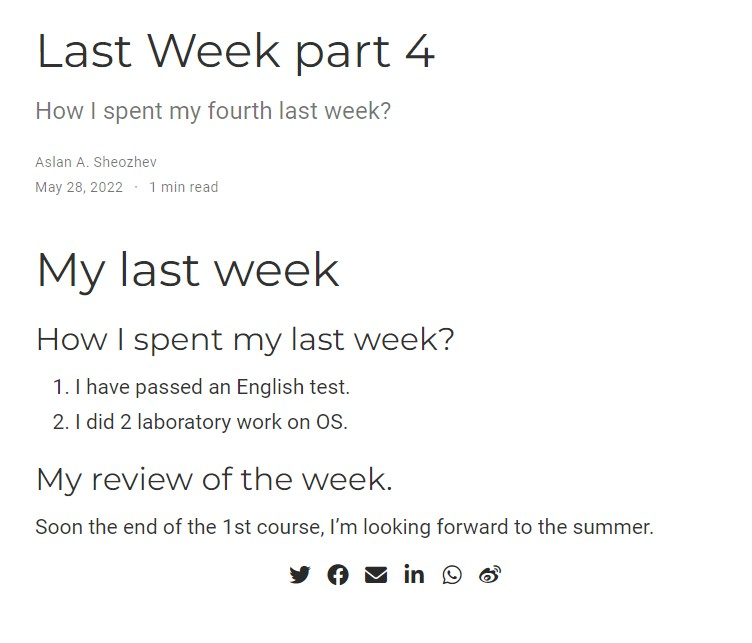
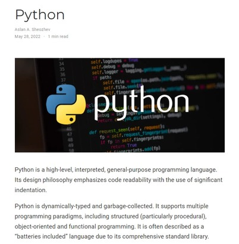

# ***Презентация по 5 этапу индивидуального проекта***
###### **Работу выполнил Шеожев Аслан Аскерович**
<!-- _backgroundColor: #11ffee00 -->
---
# Цель работы:

Добавить с сайту все остальные элементы.

<!-- _backgroundColor: #bfccbe -->
---
<!-- _backgroundColor: #bfccbe -->
## Ход работы:

* Сделал записи для персональных проектов.
* Сделал пост по прошедшей неделе. (Рис. 1)

---

 Рис.1. Пост по предыдущей неделе
<!-- _backgroundColor: #bfccbe -->

---
* Добавил пост на тему "Языки научного программирования (Python)." (Рис. 2)
<!-- _backgroundColor: #bfccbe -->

Рис.2. Пост на тему "Языки научного программирования (Python).

---

# Вывод:
Мы добавили на сайт остальные элементы.
<!-- _backgroundColor: #bfccbe -->